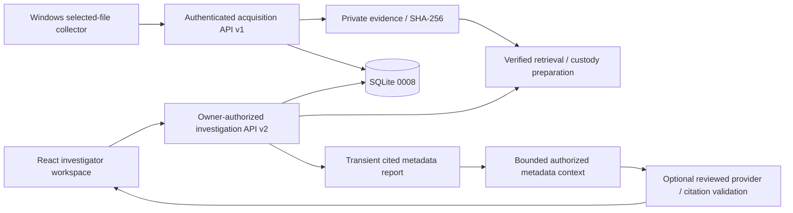

# ShadowVault AI

A local Digital Forensics & Incident Response workspace built with FastAPI, SQLAlchemy, SQLite, React and TypeScript.

ShadowVault supports selected-file evidence collection, authorized investigation and traceable metadata review. Investigators make decisions; the application does not automatically detect attacks, execute evidence or declare indicators malicious.

## Implemented capabilities

- **Cases:** Incident-as-Case, owner authorization, severity/search filters, explicit lifecycle, revision-safe updates and append-only history.
- **Evidence:** Windows selected-file collector, approved jobs, SHA-256 verification, metadata search, notes/tags and explicit verified-copy retrieval.
- **Traceability:** evidence-linked timeline observations and custody operations, separate from case history.
- **Indicators:** SHA-256, IP, domain and filename observations, evidence links, filtering and corrections; no enrichment/verdicts.
- **Reports:** transient case-scoped metadata drafts with citations and text export, not persistent final reports.
- **Guided AI review:** optional bounded metadata source selection, server-resolved citations and case-local navigation; no raw evidence analysis or open-ended chat.
- **Security preparation:** in-memory operator tokens, API privacy headers/safe errors and opt-in private logging.

Database head: **0008**. This is a controlled local pilot, not a production-certified SOC platform. See [Phase 8C verification](docs/phase8c-demo-completion-report.md) for current test results and limitations.

## Start here

Windows requires Python **3.13+** for private evidence storage, Node.js **22.18+**, npm and Microsoft Edge for browser tests. Prior verification used Python 3.14 and Node24. Linux collection is not implemented.

1. Follow [Setup](docs/setup.md) for locked installation and private operator provisioning.
2. Connect with the provisioned bearer token; email/password login is not supported.
3. Follow [Demo workflow](docs/demo-guide.md) using the supplied harmless synthetic text fixtures.
4. Review [Architecture](docs/architecture.md), [Security operations](docs/security-operations.md) and the [release checklist](docs/release-checklist.md).

No credentials or demo records are seeded at startup. Never publish a working database, private evidence, backups, reports or environment files.

## Architecture



## Repository map

- `backend/app/api`: collection and investigation contracts; legacy v1 domain placeholders remain501.
- `backend/app/services`: case/evidence authorization, custody, timeline, indicators, reports and bounded AI execution.
- `backend/app/models`, `schemas`, `db`, `core`: persistence, validation, sessions and security/configuration.
- `backend/migrations`: existing revisions0001–0008; startup does not migrate.
- `frontend/src/features`: case, evidence, indicator and timeline workflows.
- `agents/core`, `agents/windows`: shared transport/hashing and selected-file acquisition.
- `tests`, `frontend/tests`: backend/collector, service and browser regressions; provider evaluation is synthetic-only.
- `docs/demo-data`: explicit manual-demo fixtures, never production seeds.

## Verification

Run from the repository root after installation:

```powershell
.\backend\.venv\Scripts\python.exe -m unittest discover -s tests -p 'test_*.py' -v
npm --prefix frontend test
npm --prefix frontend run typecheck
npm --prefix frontend run build
npm --prefix frontend run test:browser
```

Check final exit status; browser teardown requires sufficient Windows process permissions. No live provider is needed.

## Boundaries

Disconnect clears local state, not other clients or downloaded copies. Upload verification is historical; retrieval custody means preparation, not confirmed delivery. Citations establish traceability, not truth.

OpenAI's recorded live evaluation remains incomplete; Gemini passed four fixed synthetic scenarios. Neither authorizes remote processing of real investigation metadata. Production counting remains local-only. No teams/RBAC, browser sessions, AI memory, background workers, enrichment, malware analysis or autonomous decisions are implemented.

Portfolio publication is not deployment approval. Licensing, package inspection, screenshots and hosting remain separate release gates. No screenshots or live-model claims are fabricated for this project.
