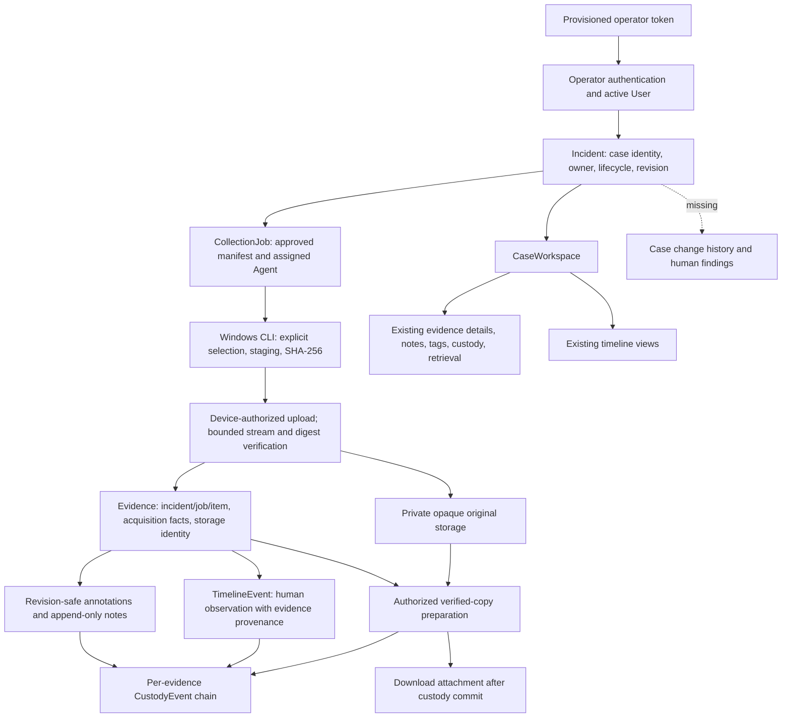
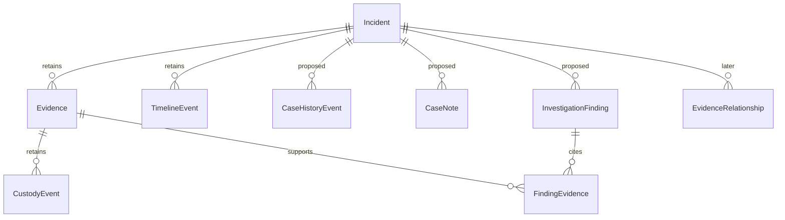

# Phase 4B: Investigation architecture audit

Date: 2026-09-08. Post-Phase 4A, documentation-only audit.

## Assessment and evidence

Retain Incident as the investigation/case aggregate. It already owns evidence,
collection jobs and TimelineEvent records. A separate Investigation entity would
duplicate identity and authorization without solving the actual gaps: case history,
human findings, review, collaboration policy and operational governance.

The system supports an owned-case, selected-file investigation workflow. It is not
yet a multi-user enterprise DFIR platform. This is a scope assessment, not a claim
that an exploit was demonstrated.

Inspected the Incident, Evidence, CollectionJob, User, TimelineEvent, CustodyEvent,
annotation and integrity models; collection/investigation/case/timeline/retrieval
routes and services; security, storage reader and application wiring; case/evidence/
timeline frontend features and shared client; migration history, architecture and
Phase 4A report; relevant backend regression definitions. Source references below
are repository-relative links. No application server, collector, test or build was
run during this audit.

Read-only SQLite query confirmed the development database at **0005**, the expected
post-Phase 4A revision. The chain is 0001 foundation → 0002 collection → 0003
investigation → 0004 timeline provenance → 0005 Incident revision. No migrations
were created or applied. Prior recorded verification is 115 backend, 28 service and
31 browser tests passing plus typecheck/build; these are prior results, not new
audit test results. An old private browser fixture directory was inaccessible to
the broad file inventory; its contents are not needed for this source audit.

## Current architecture diagram

The arrows from evidence operations to custody mean application recording, not
physical custody transfer. Upload does not append a custody event today. A baseline
is created lazily by the first annotation, observation or retrieval operation;
it must not be interpreted as a retrospective acquisition event.

## Incident lifecycle

[Incident](../backend/app/models/incident.py) contains id, created_at, title,
description, severity, status, created_by_id and revision. `created_by_id` currently
serves both creator attribution and access ownership. Status defaults to open;
severity defaults to medium. No case number, assignee, scope, closure reason,
closed_at, updated_at, case notes, disposition or case change history exists.

[The case service](../backend/app/services/incidents.py) permits open → investigating
→ closed and closed → investigating. Same-status edits are permitted. The API checks
the owner and expected revision, then performs a conditional owner/revision update.
Revision is a concurrency counter, not an audit log. It cannot identify an editor,
recover earlier descriptions or explain a closure. Lifecycle validation is at the
service boundary; the database constrains enum values, not the transition graph.
Trusted direct SQL can bypass service transitions and revision discipline.

Closing a case intentionally does not freeze evidence, revoke agents, cancel jobs
or disable observations/retrieval. A future closure gate must be explicitly
approved; do not silently reinterpret the existing status field.

## Evidence relationships and acquisition

[Evidence](../backend/app/models/evidence.py) belongs to exactly one Incident.
Its job/incident composite foreign key prevents inconsistent collected evidence
association. Job/item uniqueness provides retry identity; equal hashes alone do
not mean the same acquisition. Storage keys are unique opaque object identities.
Legacy evidence is explicitly distinguishable from collected, verified evidence.

Acquisition facts include filename, source_path, media_type, size, SHA-256,
collected_at, verified_at, collected_by_id and job/item provenance. Agent identity
is reachable through the job. `collected_by_id` is populated from the requesting
operator, not a claim that this human physically handled the source device.
Device-supplied collection time describes the source report; verified_at records
server verification time. Hash agreement proves byte agreement with the submitted
digest, not authenticity of the source host or correctness of its clock.

The [upload route](../backend/app/api/routes/collection.py) authenticates the assigned
agent, checks the manifest item and limits, releases its read transaction during
streaming, then rechecks credential/job authorization before promotion and commit.
The storage layer independently verifies length/digest. Duplicate submissions return
the original receipt when their digest/size agree; conflicting bytes are rejected.
Original bytes are not parsed or executed. Filesystem promotion and SQL commit are
not one crash-atomic transaction: exception cleanup exists, but abrupt process
termination can leave an orphan object needing a future explicit reconciliation
procedure. No such procedure is implemented or authorized here.

Mutable display title, review state and tags are separate from acquisition facts.
EvidenceNote is attributed and append-only through normal ORM operations. Annotation
revision changes, note/tag changes and custody appends commit together. No secondary
case link or evidence-to-evidence relationship exists. Do not move an evidence row
to another case or copy its blob merely to express an investigative relationship.

## Timeline workflow and provenance

[TimelineEvent](../backend/app/models/timeline.py) remains the sole forensic event
system. New investigator observations require evidence, actor attribution, source,
aware occurrence time and an idempotent submission identity. Incident is derived
from evidence; the composite evidence/incident foreign key enforces that pairing.

[Timeline service](../backend/app/services/timeline.py) stores UTC occurred_at,
preserves the submitted offset in reported_time, and separately records created_at.
It fingerprints the submission, accepts identical retries, rejects reused IDs with
different content, and appends custody atomically. Investigator events are guarded
against ORM update/delete. Legacy events remain distinguishable and retain their
older behavior. Reads apply incident ownership and, for linked events, evidence's
additional job ownership policy. Search supports incident/evidence, origin, time
range, literal text and ordered cursors.

An observation is a human assertion, not an established incident fact. There is no
review/dispute state, correction/supersession relation, uncertain time range or
multi-evidence support per event. Add these only through a reviewed extension of
TimelineEvent, preserving originals, retry fingerprints and old API behavior.

## Custody versus investigation history

[Custody service](../backend/app/services/custody.py) appends an attributed event,
computes its canonical hash and conditionally advances Evidence's sequence/head
within the caller's transaction. Uniqueness checks constrain sequence and operation
identity. [Custody model](../backend/app/models/custody.py) rejects normal ORM mutation.
Actor IDs, label snapshots and server timestamps provide application attribution.
The model permits agent actors, but the current append helper emits user/system
actors; the upload path does not use it.

Current custody includes annotation, note and observation actions as well as
retrieval preparation. Preserve those event types and hashes. This is evidence-level
application history; it is neither complete case history nor a physical-transfer
ledger. The custody GET returns entries/head metadata, not an independent attestation
that the chain was externally verified. `verify_chain` checks against the head stored
in the same database. A privileged writer can bypass ORM hooks and rewrite both
events and head. No external anchor or administrator-resistant audit store exists.

[Retrieval](../backend/app/services/evidence_retrieval.py) authorizes before reading,
prepares a private size/hash-verified copy outside a long SQL transaction, rechecks
authorization and identity, and commits custody before serving bytes. The recorded
event means prepared, not delivered or saved. Integrity-check rows and original
metadata remain unchanged. Route cleanup uses nested finally blocks to release
capacity even if close fails; this preflight behavior remains present.

Future case history should record case edits, status reasons, assignments and human
review actions separately. It must not manufacture custody entries on every case
change or repurpose TimelineEvent into an application activity feed.

## Authentication, authorization and security findings

1. **Enterprise identity blocker — single configured operator.**
   [security.py](../backend/app/core/security.py) compares a bearer-token digest to
   one configured secret and resolves one configured active user. There is no
   operator-session expiry, per-user credential issuance, MFA or role membership
   workflow. Agent credentials are separate, expiring and revocable. Sharing the
   operator token would collapse human attribution. Existing login/me endpoints
   remain 501 placeholders. Do not expose this as enterprise multi-user identity.

2. **Collaboration design blocker — access is stricter than case ownership alone.**
   [Evidence queries](../backend/app/services/evidence_query.py) require incident
   ownership and, when collected, collection-job requester ownership. Collection
   authorization also ties requester to agent registrant and assigned device.
   Timeline and retrieval reuse these boundaries. A UI membership list alone
   would not grant usable access; changing only one predicate could leak records
   or produce inconsistent visibility. Creator attribution must not be rewritten
   to simulate reassignment. Approve a full resource/action policy before sharing.

3. **Accountability gap — no case change history.**
   Case CAS prevents stale overwrites but stores no prior values, change reason or
   editor snapshot. Add transactional case history before claiming audited case
   management. Do not backfill invented historical edits from the current revision.

4. **Integrity trust boundary — application append-only is not administrator-proof.**
   ORM hooks do not prevent bulk SQL or privileged storage/database replacement.
   Acquisition fields are protected by public write contracts, not blanket database
   immutability. Document trusted administrators and require separately approved
   storage/audit controls before stronger claims. No exploit attempt was performed.

5. **Sensitive metadata cache policy is incomplete server-side.**
   The shared browser client uses `cache: no-store`, and download responses explicitly
   return no-store. The inspected case/evidence/timeline JSON routes have no equivalent
   response header or common middleware. Future hardening should make sensitive API
   response policy explicit for other clients/proxies. This is a policy gap, not
   proof that an authenticated response is currently publicly cached.

6. **Bounded local capacity is not enterprise capacity governance.**
   Upload/retrieval semaphores are per application process; more workers multiply
   the effective disk/CPU budget. Exact count queries, wildcard text search and
   complete chain verification can grow expensive despite pagination. SQLite and
   local Windows storage are the verified deployment. Tenant quotas, retention,
   disaster recovery and multi-worker limits are not established by passing tests.

7. **Browser lifetime boundary needs accurate wording.**
   Tokens stay in a closure, travel in Authorization headers, and are cleared on
   disconnect/reload/401. HTTPS is required except loopback; redirects are refused.
   This reduces persistence but does not protect against a compromised same-origin
   script. Navigating to Overview/Sign in hides the shared workspace rather than
   ending the connection; it is not logout. Preserve or explicitly revise this
   behavior, and test it when a real session system is separately authorized.

No cross-owner bypass was established by this static audit. Negative authorization
tests exist for cases, evidence, timeline and retrieval; a future policy extension
must keep them and add a complete multi-user action matrix.

## Frontend flow and missing workspace concepts

`App` hash navigation → `InvestigationWorkspace` (shared operator/client lifetime)
→ `CaseList` / `CaseWorkspace` → shared API client → v2 case/evidence/timeline routes.
CaseWorkspace locks incident filters in the parent and embeds EvidenceSearch or
TimelinePanel. Nested EvidenceDetailsPage reuses AnnotationsPanel, CustodyHistory,
IntegrityStatus, timeline entry form and EvidenceDownload. Backend checks remain
authoritative; disabled UI filters are not an authorization mechanism.

Case event links intentionally open the existing global timeline details. Case
forms block automatic retry on uncertain writes; users reload and discard drafts
explicitly. Creation has no idempotency key, so uncertain creation requires list
review. Existing useResource abort/stale-result handling supports safe navigation.

Missing enterprise concepts include a case narrative and objectives, decisions and
finding citations, assigned human work and review, asset/person context, evidence
relationships, closure rationale, physical transfer records, export snapshots,
retention/legal-hold policy and per-user access governance. These are candidate
requirements, not implemented features or promises of compliance. No automatic
decision, task execution or evidence analysis is needed to model human work.

Maintainability concerns: incident ownership checks occur in case, timeline and
collection services; status transitions are duplicated in Python and TypeScript;
the client under `features/evidence` now serves cases and timeline too. These are
manageable local duplication, not grounds for framework replacement. Before changing
policy, use contract tests to prevent drift; relocate helpers only in an approved,
behavior-preserving patch. Several route handlers intentionally own transaction
completion; new services must not introduce hidden intermediate commits.

## Recommended future data model — proposal only

Preserve every current identity, foreign key, record and route. No new schema is
needed merely to improve workspace composition. The following additions require
separate approval and demonstrated field-level need before any migration:

- **Incident:** retain current fields. Consider optional scope/objectives and closure
  reason/time only after defining human closure/reopening semantics. Keep revision
  for CAS. Never rename created_by_id into an assignee or silently change its meaning.
- **CaseHistoryEvent:** incident FK, per-case sequence, operation/submission ID,
  event type/schema version, actor ID plus label snapshot, server recorded_at,
  affected revision, bounded before/after values and optional human reason. Append
  with the case mutation in one transaction; rollback both on failure. Use unique
  incident/sequence and operation identity. Record an honest adoption baseline
  for existing cases, not guessed history. If tamper evidence is required, specify
  it explicitly rather than calling an ordinary append-only table a custody chain.
- **CaseNote:** incident FK, author ID/label, body and recorded_at; append-only human
  case narrative, separate from evidence-specific EvidenceNote. Corrections reference
  earlier notes rather than changing their text.
- **InvestigationFinding and FindingEvidence:** a human-authored finding with case,
  statement, rationale, author, explicit review state and revision; evidence links
  carry source locators. Enforce same-case and authorized-evidence references.
  These represent assertions with supporting material, not automatically accepted facts.
- **EvidenceRelationship (later Phase 4C):** incident FK, source/target evidence IDs,
  explicit relation type, author, rationale, timestamp and submission identity.
  Enforce same-case endpoints, no self-link and a defined duplicate policy. Revocation
  should retain the original assertion. Cross-case sharing requires a separate policy;
  do not weaken the existing acquisition relationship.
- **TimelineEvent extension (later Phase 4D):** optional supersedes-event relation
  with same-case/evidence-policy validation and explicit correction reason. Retain
  original observations and their custody; prevent cycles. Uncertain time ranges or
  additional evidence links require separately specified semantics and contracts.
- **CaseMembership (separate identity approval):** case/user uniqueness, explicit
  role, grantor, granted/revoked times and history. It is not useful securely until
  individual authentication and the case/job/evidence action policy are defined.
  Do not introduce a Tenant table without an approved tenancy requirement and a
  complete isolation design across database, storage, tokens and queries.

## Safe implementation boundaries and acceptance gates

1. **Next recommended slice: case history foundation.** Agree event vocabulary and
   visibility first. Then, only with implementation approval, add transactional case
   history and a read-only history panel in the current workspace. Keep existing
   status semantics, API responses and revisions. Prefer additive history endpoints;
   do not turn custody into case history. New persistence would require an approved
   additive migration after 0005 with a populated upgrade and backup plan.
2. **Human investigation workspace:** case notes and explicit findings/citations in
   separate small slices. Reuse the current in-memory operator client and evidence
   picker contracts. No AI, extraction, scheduling, background work or automatic
   review decisions. Show findings, forensic events and application history with
   distinct labels and timestamps.
3. **Phase 4C relationships:** same-case manual relations first; preserve original
   evidence and collection identity. Cross-case grants remain out of scope.
4. **Phase 4D timeline views:** filters/grouping can reuse existing APIs without a
   migration; provenance correction needs an explicitly approved model extension.
5. **Enterprise identity/deployment:** separate prerequisite track before enabling
   collaboration; no implicit addition to the current Phase 4B scope.

Future tests must prove case/history atomic rollback and CAS conflicts; honest legacy
baseline adoption; inaccessible cross-owner references; immutable history/corrections;
explicit retry deduplication; pagination and concurrent changes; role/action denial
before membership is enabled; no case status side effects; and shared frontend
disconnect, navigation, conflict and stale-response behavior. Retain all existing
upload/receipt, Windows CLI, note/tag/custody, timeline provenance/retry and retrieval
verification/capacity regressions. Tests must distinguish acquired bytes, human
observations, case history and copy preparation from delivered files.

## Audit completion

Only `docs/phase4b-architecture-audit.md` was created. No application code, migration,
dependency, configuration or database record was changed. No implementation,
automation, analysis engine or new project was started. The current database remains
at revision 0005. Stop here pending separate implementation approval.
