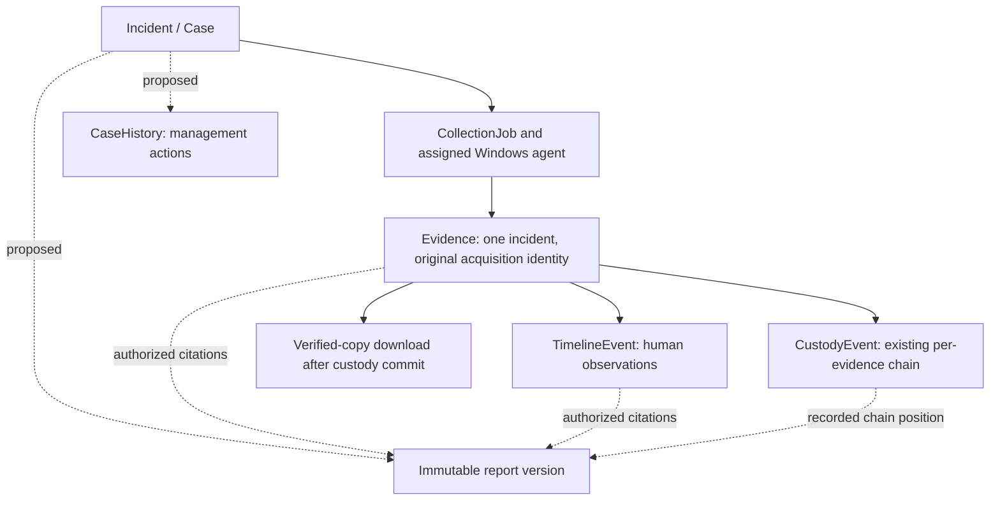

# Phase 4C — Case management foundation design

Date: 2026-09-08. Design review only; database baseline **0005**.

## Decision and current architecture

Keep **Incident as Case**, retaining its UUID, evidence/job relationships and
revision-safe update pattern. Do not create a parallel Case aggregate or replace
TimelineEvent. The six-state workflow below is a future contract, not behavior
implemented by this document. The phase names in this document follow the current
request; earlier roadmap references to Phase 4C evidence relationships are historical.

Reviewed [Incident model](../backend/app/models/incident.py),
[case service](../backend/app/services/incidents.py),
[case contracts](../backend/app/schemas/incident.py),
[authentication](../backend/app/core/security.py),
[evidence access](../backend/app/services/evidence_query.py), custody models/services,
0005 and the [Phase 4B audit](phase4b-architecture-audit.md).
Current owner authorization uses created_by_id; collected evidence additionally
requires collection-job requester ownership. Operator identity is one configured
token/user, not an implemented role or multi-user session system.

Current Incident states are open, investigating and closed. The current service
allows open → investigating → closed, closed → investigating and same-status edits.
Status does not cancel collection or prevent evidence work. Case changes have a
revision counter but no durable change history. Evidence operations have their own
custody history, and investigator observations have separate forensic timestamps.

## 1. Proposed lifecycle

These states describe human case management, not automated host actions:

- **New:** intake exists; no accepted investigative assignment yet.
- **Assigned:** an active investigator has been assigned and accepted responsibility.
- **Investigating:** active evidence review and hypothesis assessment.
- **Contained:** a human has recorded containment scope, supporting references and
  remaining risk. The application has not performed or independently verified containment.
- **Resolved:** a Security Manager has accepted the documented disposition. This does
  not assert that all risks have objectively disappeared.
- **Archived:** retained case record; ordinary management edits are frozen in the
  future workflow. Archival is not deletion or an evidence retention decision.

### Allowed transition matrix

All actors must be active, in the same organization, and explicitly authorized for
the case. Role alone never grants access to another organization's case. Admin
does not inherit operational permissions; an Admin must hold a separately granted
Security Manager or Investigator role to perform those actions.

| From | To | Authorized actor | Required human input |
|---|---|---|---|
| New | Assigned | Security Manager | Active investigator, assignment acceptance and reason |
| Assigned | New | Security Manager | Withdrawal reason; clear responsible owner |
| Assigned | Investigating | Assigned Investigator or Security Manager | Start acknowledgement; active owner remains assigned |
| Investigating | Contained | Assigned Investigator or Security Manager | Containment statement, scope and supporting references |
| Contained | Investigating | Assigned Investigator or Security Manager | Reason containment is insufficient or new facts require review |
| Investigating | Resolved | Security Manager | Disposition and explicit reason containment is unnecessary/not applicable |
| Contained | Resolved | Security Manager | Disposition, residual risk and review acknowledgement |
| Resolved | Investigating | Security Manager | Reopening reason and active investigator assignment |
| Resolved | Archived | Security Manager | Archive rationale and acknowledgement of retained records/jobs |
| Archived | Resolved | Security Manager | Explicit restoration reason; separate reopen action if investigation resumes |

Assignment acceptance is an attributable human action; the manager cannot fabricate
the investigator's acceptance. A future assignment request may be pending while the
case remains New. Reassignment within an active state requires manager authority,
new investigator acceptance, a current revision and its own history event.

Every transition not listed is invalid. In particular New → Resolved, Assigned →
Contained, Investigating → Archived and Archived → Investigating are rejected.
No timer, collector, AI suggestion or token possession alone can change state.
Same-state metadata edits are not transitions; record them as edits. A no-op request
must not invent a transition. Viewers cannot transition cases.

Proposed Resolved cases allow manager-approved rationale corrections and authorized
reads; further investigation requires explicit reopening. Proposed Archived cases
allow authorized read/download/export and restoration only, not ordinary edits,
new annotations, links or observations. These are **new semantics requiring approval**,
not restrictions to apply to existing closed cases now. Existing approved collection
jobs and receipts must remain valid; archive never implicitly cancels an upload.
Warn a manager about active jobs and record acknowledgement. A job-control change
would require an explicit separate operation and contract review.

### Compatibility with 0005 and existing clients

Do not rename enum values or bulk convert records now. `open` does not prove New
versus Assigned, and `closed` does not prove Resolved versus Archived. Proposed
adoption: retain the existing status and introduce a nullable workflow state on
Incident only if approved. Unadopted rows retain exactly their current lifecycle.
A manager explicitly adopts a case, records the selected state, owner and reason,
and creates an honest adoption event. No historical assignment or containment is inferred.

Existing investigation API status fields continue to have their old meanings.
Use an additive opt-in workflow contract rather than returning new enums in old
responses. Once a case opts in, legacy writes that could bypass its workflow need
an explicit, documented conflict response directing the caller to the new contract;
do not silently accept an old closed/open write as a richer transition. Opt-in
therefore requires explicit client compatibility approval. Existing unadopted case
behavior and tests remain unchanged. This dual-contract period is transitional,
not a second case system or two independently writable sources of workflow truth.

## 2. Case and case-history data proposal

Logical Case remains the existing `incidents` record:

| Field | Design |
|---|---|
| id | Existing immutable UUID; preserve all foreign keys |
| title | Existing required bounded string, trimmed, max 200 |
| description | Existing text; retain API bound of 10,000 characters |
| severity | Existing low/medium/high/critical; distinct from workflow status |
| status | Proposed six-state workflow; compatibility strategy above; no enum replacement now |
| owner | Proposed nullable responsible investigator FK, distinct from immutable creator; required from Assigned through Resolved; historical owner may later become inactive |
| created_at | Existing server UTC creation timestamp, never rewritten |
| updated_at | Proposed server UTC last effective case mutation; no client override; historical value unknown until adoption/first tracked update |
| revision | Existing nonnegative integer CAS token, increment once per effective case mutation |

Retain created_by_id as original creator/provenance. Never overwrite it to reassign
access. Owner is responsibility, not the sole permission rule in the future design.
User deactivation retains references and labels; an active case requires explicit
reassignment before further transitions. Proposed organization_id and grants are
separate future access-boundary fields, not substitutes for original creator IDs.

CaseHistory (logical name; physical naming decided during implementation review):

| Field | Design |
|---|---|
| id | Server-generated immutable UUID |
| case_id | FK to Incident with restricted deletion |
| actor | Authenticated user FK plus label snapshot; actor kind distinguishes human from clearly identified migration/adoption baseline |
| action | Versioned allowlist: created, adopted, edited, assigned, assignment_accepted, status_changed, access_changed, report_exported |
| previous_value | Bounded typed JSON of affected fields before the change; null only when semantically absent |
| new_value | Bounded typed JSON of affected fields after the change |
| timestamp | Server UTC recording time; no client-supplied audit time |
| metadata | Schema-validated reason, request/operation ID, policy version and references; no credentials or arbitrary unbounded payloads |

Supporting fields: schema_version, per-case sequence, revision_before,
revision_after and unique operation/submission ID with request fingerprint for
safe explicit retries. A transition combines its related field changes into one
atomic event. Informational events such as export can retain the same case revision
while advancing history sequence. Do not use case revision as the history sequence.
Grant changes need both an access-policy revision and attributable history.

Foreign keys restrict destructive deletion; sequence uniqueness and CAS prevent
duplicate competing appends. Legacy baseline snapshots disclose when tracking
began and do not pretend to reconstruct missing revisions. No migration or table
has been created by this design.

## 3. Role and permission architecture

Roles are scoped grants. Default deny; evaluate active identity, organization,
case grant, action, evidence restrictions and workflow state on every request.
The matrix describes maximum role capability, not automatic access to all cases.

Legend: **Scoped** requires an explicit case/team grant; **Assigned** additionally
requires investigative assignment; **No** is denied. Admin access requires a
separately granted operational role, never an implicit superuser bypass.

| Action | Admin | Security Manager | Investigator | Viewer |
|---|---|---|---|---|
| View cases | No | Scoped | Scoped | Scoped |
| Modify cases | No | Scoped, lifecycle-gated | Assigned, editable fields only | No |
| Link evidence | No | Scoped | Assigned | No |
| Download evidence | No | Scoped + evidence.download | Scoped + evidence.download | No |
| Add timeline events | No | Scoped, state-gated | Assigned, state-gated | No |
| Export reports | No | Scoped + report.export | Scoped + report.export | No |

Security Manager may create cases in an authorized organization and assign/review
them. Investigator may submit intake for a New case within an approved scope;
this does not self-grant manager powers. Viewer sees only authorized case metadata
and permitted evidence metadata/custody/timeline; raw bytes and exports are denied.
Investigators cannot edit ownership, organizational scope, grants or manager-only
dispositions through ordinary metadata fields.

Admin handles identity/team configuration through separate administrative
capabilities. Operational role grants require independent authorized approval;
no self-promotion or self-approval. Initial bootstrap is a trusted, recorded
provisioning operation, not a public endpoint. A dual-role person receives the
explicit operational role's permissions, with denial/organization restrictions
still applying. Manager authority to assign work does not include editing the
organization's role definitions. Emergency access, if ever needed, is a separate
time-limited, reviewed design; no bypass is included here.

## 4. Evidence relationship model

**One evidence record belongs to one case in this foundation.** Preserve
Evidence.incident_id and job/item identity, composite constraints and original
storage object. Equal hashes are not permission grants or proof of identical
acquisition. Do not reparent evidence, deduplicate custody chains or duplicate
bytes to simulate cross-case collaboration.

“Link evidence” means create an authorized same-case investigative reference,
such as a report citation or future evidence relationship. It does not mean change
the evidence's parent. Check case access and both endpoints before accepting a
relationship; validate at database and service boundaries. Multiple-case attachment
and cross-organization evidence sharing are explicitly deferred. If required later,
design independently authorized references to the original evidence, without
changing acquisition ownership or granting access merely by exposing a link.

TimelineEvents remain under the same case and reference supporting evidence;
CustodyEvents remain under Evidence; Reports are derived case artifacts citing
evidence, timeline and relevant custody positions. They are not children that
inherit unlimited access merely from the diagram. Report content authorization
must check every cited record and the chosen export scope.

Custody **existing records, sequence and hashes must never be altered**. New
legitimate evidence operations may append events through the existing transactional
service. Case assignment/status/history does not rewrite or recalculate custody.
Existing lazy baselines and retrieval-prepared semantics remain unchanged; do not
claim download delivery or physical transfer from preparation alone.

The current requester/creator/agent checks cannot simply be deleted to enable
sharing. Before Phase 5B activation, specify equivalent action-based checks for
jobs, device assignment, evidence queries, notes, timeline, retrieval and exports
together. Retain acquisition attribution even when a different investigator gains
an explicit read grant. Recheck permission before releasing a prepared copy/report;
revocation prevents new releases but cannot recall bytes already delivered.

## 5. Append-only audit architecture

CaseHistory explains management actions. TimelineEvent records human observations
about incident occurrence. Custody records evidence operations. Keep these three
meanings distinct in services, UI labels, timestamps and exports.

Proposed transaction sequence:

1. Authenticate and authorize the actor/action/resource; reject inactive identities.
2. Load current case and access-policy revision; validate fields, transition,
   assignment acceptance and supplied expected_revision.
3. Atomically claim the case revision and history sequence; revalidate policy or
   lock its version so concurrent revocation cannot authorize a stale write.
4. Store changed fields and the before/after history event in the same SQL transaction.
5. Commit once; on history, constraint or commit failure, roll back the whole mutation.

Return 409 on stale revision; never overwrite with last-writer-wins. UI preserves
drafts and requires explicit refresh/review. A repeated operation ID with identical
content returns the original outcome only after current access is checked; different
content is a conflict. No automatic write retries. Separate ordering by sequence
from wall-clock timestamps, since server clocks can move backwards.

Application APIs expose no update/delete history route. ORM hooks alone are not
administrator-proof: future database permissions and tested database-level guards
should protect append-only tables. Restricted FKs prevent accidental cascade
deletion. Cryptographic chaining, if chosen for case history, requires independent
anchors/operational controls to resist privileged rewriting; do not claim such
protection from a head stored beside its events. Corrections append references to
the earlier event. Audit text uses bounded structured fields; credentials and raw
evidence payloads must never be placed in metadata. Rejected requests belong in a
separate sanitized security audit channel, not a fabricated successful case event.

## 6. Multi-user readiness without authentication implementation

Define a future principal interface: stable user ID, active status, authenticated
organization context, trusted credential identity and effective grant versions.
Only the trusted authentication boundary may produce this principal. Browser input
cannot assert roles or organization membership. The existing operator remains an
explicit compatibility principal; do not equate a shared token with multiple humans.

Proposed Organization is the isolation boundary; Team groups investigators within
one organization; organization/team membership is distinct from case grants and
case responsibility. Team membership changes require versioned authorization and
history. New team members must not silently gain historical cases unless an explicit
team-scoped case grant says so. Revoked membership must invalidate effective access,
including in-progress prepared release checks and cached authorization decisions.

Organization constraints must cover cases, jobs, agents, evidence, derived reports,
queries, counts, storage resolution and audit visibility. A UI filter is insufficient.
Direct UUID lookups, cursors and aggregates must apply the same policy as list reads.
Do not use organization IDs or filenames directly as trusted storage paths.
Keep tokens in memory, never URLs, logs, browser storage or build configuration.
No identity provider, login flow, token issuance or dependency is implemented here.

## 7. Future AI boundary — Phase 6 only

Allowed, under separately approved evidence access and human review:

- Summarize explicitly authorized evidence with precise source citations.
- Explain an authorized timeline while distinguishing observations from conclusions.
- Suggest investigation paths as proposals with uncertainty and supporting references.

Forbidden:

- Modify original evidence or acquisition facts.
- Alter, delete or rewrite custody records.
- Close, resolve, contain, archive or reassign cases automatically.
- Make final security decisions or approve its own recommendations.

Future AI uses a least-privilege read interface, not raw database/storage access or
an operator token. Evidence text is untrusted input, never instructions granting
tools or access. Retrieved content is re-authorized per source; cross-case context
mixing, hidden prompt retention and unrestricted provider export are prohibited.
AI drafts are distinguishable derived artifacts with model/version, generation
time, input references and explicit human acceptance attribution. A human accepting
a suggestion uses the normal authorized revision-safe workflow. No AI integration,
parser, evidence execution, training pipeline or automatic job is approved here.

## 8. Security design review

- **Unauthorized evidence access:** a visible case or shared report could reveal
  evidence restricted by job ownership. Enforce resource/action checks for every
  citation, byte read and export; prohibit cross-case links initially. Future tests
  must cover direct IDs, changed grants, nested resources and aggregate leakage.
- **Privilege escalation:** client role fields, mutable owner IDs and administrative
  self-grants can bypass least privilege. Reject server-owned fields, separate role
  administration from operational actions and require independently approved grants.
- **History tampering:** direct SQL bypasses ORM hooks; mutable JSON can hide edits.
  Use explicit transaction ownership, immutable event contracts, restricted runtime
  credentials and database guards. External tamper evidence remains a separate
  deployment decision. Existing custody must not be rewritten during adoption.
- **Accidental deletion:** archive is not delete. No hard-delete endpoint; restrict
  referenced identities/cases and preserve originals. Retention and legal hold need
  a separately approved policy, never a side effect of lifecycle state.
- **Conflicting updates:** preserve CAS across metadata, assignment and transitions;
  include policy revision in the authorization transaction. Failed history append
  must roll back the edit. Distinguish case revision from history sequence.
- **Sensitive exports:** render only authorized content, escape untrusted text,
  remove credentials/private paths, set explicit cache policy and bound size.
  Keep report versions immutable with source IDs/revisions/hashes and human approval;
  an export is a snapshot, not proof of source authenticity or successful delivery.
- **Operational assumptions:** single configured operator, local storage and SQLite
  remain the current deployment boundary. Team scale, distributed concurrency,
  independent audit anchoring and provider data handling require verification before
  enterprise claims. This design review is not penetration testing or certification.

## 9. Future roadmap and review gates

### Phase 5A — Database foundation

After schema approval, extend Incident additively and introduce the minimum case
history/access structures needed for subsequent steps. Do not prebuild every future
table. Preserve 0005 data, UUIDs and original custody hashes; take a verified backup
before any future migration. Test a populated upgrade and recovery strategy.
No migration number is allocated here. Workflow fields remain dormant until their
authorization and history write path are ready. New states must not ship ahead of
transactional history merely because the table exists.

### Phase 5B — Role-based access

Implement the approved principal/policy boundary and scoped grants, preserving the
legacy operator path for unadopted cases. Test all role/action combinations,
cross-organization rejection, grant revocation, assignment changes and evidence/job
boundaries. Individual authentication integration requires separate approval;
do not enable public multi-user access with a shared token. Role and grant writes
must be audited from their first activation; no unaudited interim release.

### Phase 5C — Case history

Complete transactional event append/read APIs, baseline adoption, lifecycle actions
and history UI. Enable the richer workflow only when history and Phase 5B policy
are operational together. Verify CAS, duplicate explicit retry, rollback, timestamp
semantics, append-only guards and legacy API compatibility. Reuse the current Case
Workspace and operator/client abstraction; no second timeline or framework.

### Phase 5D — Reports/export

Design immutable human-reviewed report versions and authorized export with bounded
resource use, source snapshots and sanitized metadata. Apply evidence-level access
to every cited source and recheck before release. Record report creation/export as
case history; do not mislabel it as evidence delivery. No report engine/dependency
is selected by this document. Test revoked access, stale citations, hostile text,
partial failures and content/digest consistency.

### Phase 6 — AI assistant layer

Only after separate approval of data handling and read permissions: cited summaries,
timeline explanations and suggestions. Test prompt injection resistance, denied
source access, citation accuracy, human acceptance and zero mutation capability.
No AI functionality is part of Phases 5A–5D.

For every implementation slice retain existing collection/Windows CLI, upload retry,
evidence annotation, timeline, custody and verified-copy regressions. Future tests
are design requirements only; **no tests are required or run for this documentation
task**. No dependencies, migrations, source changes or database writes are authorized.

## Acceptance and stopping point

Only `docs/phase4c-case-management-design.md` is created. Database revision is checked
read-only before and after documentation creation and remains **0005**. Source and
database file fingerprints are compared to verify no changes during this task.
No application source, configuration, migration or dependency file is modified.
All lifecycle, role, history, report and AI changes above are proposals requiring
separate implementation approval. Stop after this design review.
