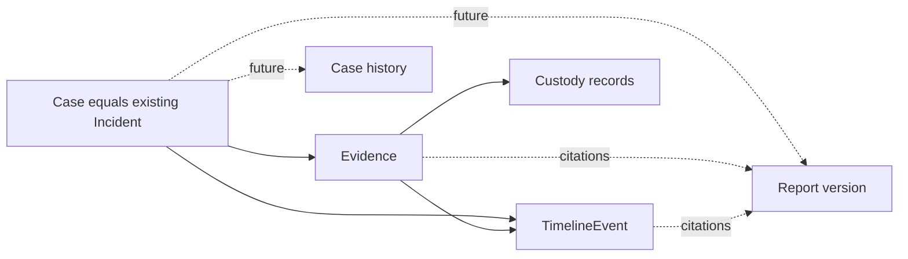

# Phase 5A — Case Foundation architecture audit

Date: 2026-09-08. Documentation only. Current database revision: **0005**.

## Scope and recommendation

Choose **Option A: Incident remains the Case entity**. Keep the physical `incidents`
table, UUIDs, existing lifecycle, ownership and references. “Case” is the user-facing
domain name, not a new container or duplicate record. The minimal missing Case field
is a trustworthy last-update timestamp. Case history, richer lifecycle, team roles
and reports require separately approved slices.

This audit narrows the earlier [Phase 4C design](phase4c-case-management-design.md)
into a minimal implementation path; it does not activate that design. The phase
ordering here follows the latest request: 5A database, 5B APIs, 5C history, 5D roles,
5E reports. Earlier phase labels remain historical. No AI, authentication, workflow
automation or evidence analysis is part of this foundation.

## 1. Existing architecture and invariants

Reviewed [Incident](../backend/app/models/incident.py),
[Incident service](../backend/app/services/incidents.py),
[case schemas](../backend/app/schemas/incident.py),
[case routes](../backend/app/api/routes/investigation_incidents.py),
[evidence authorization](../backend/app/services/evidence_query.py),
[TimelineEvent](../backend/app/models/timeline.py),
[retrieval service](../backend/app/services/evidence_retrieval.py),
[security](../backend/app/core/security.py), and the previous
[Phase 4B audit](phase4b-architecture-audit.md) and Phase 4C design.

- **Incident:** id/created_at come from RecordMixin; title, description, severity,
  status, created_by_id and revision already exist. The status graph is open →
  investigating → closed, with explicit closed → investigating reopening and
  same-status edits. Owner-and-revision conditional SQL prevents stale overwrites.
  Keep this graph and existing validation; do not equate closed with archived.
- **Evidence:** one Incident per evidence record. The collection-job/incident
  composite foreign key preserves acquisition context; job/item uniqueness gives
  upload retry identity. Keep immutable acquisition facts, original storage keys,
  hashes and bytes. Equal hashes do not merge ownership or custody.
- **Timeline:** Incident owns TimelineEvent records. Investigator observations link
  evidence in the same Incident through a composite constraint; legacy events may
  lack an evidence link. Keep occurrence time, submitted offset, recording time,
  actor provenance, submission deduplication and append-only observation behavior.
  TimelineEvent remains the only forensic timeline system.
- **Custody:** per-evidence events, sequence and hash head record evidence operations.
  Existing baseline, note, annotation, timeline and retrieval records remain intact.
  A case title/status update is not an evidence custody event. ORM append-only guards
  and an internally stored hash chain do not provide administrator-proof storage.
- **Retrieval:** authorize, copy and verify bytes outside a long SQL transaction,
  recheck identity/access, commit preparation custody, then stream the attachment.
  Retain bounds, private storage handles, cleanup/capacity release, no preview and
  no execution. Preparation does not prove delivery or local saving.
- **Authorization:** a configured operator credential maps to one active User.
  Incident.created_by_id currently acts as access owner. Collected evidence also
  requires the same user's CollectionJob.requested_by_id. Assigned device credentials
  have separate agent/job restrictions. Preserve all layers; case access alone is
  not a shortcut to every evidence record.

Existing v1 contracts, v2 investigation APIs, frontend Case Workspace, collection
and Windows collector behavior should remain unchanged. The system already has
case CRUD under an incidents URL; it is not missing a second CRUD implementation.

## 2. Incident versus Case decision

### Option A — Incident is Case (recommended)

- **Duplication:** no duplicated title, status, owner or revision. Case ID is Incident ID.
- **Migration:** optional additive fields only; no record moves, ID mapping table or
  evidence/timeline FK rewrite.
- **Permissions:** retain current incident/job checks. Later scoped grants can refer
  to the same UUID without rewriting creator attribution.
- **History:** a future CaseHistoryEvent refers directly to Incident. One mutation
  transaction and revision domain can cover title/status changes and history.
- **Teams:** future case/team grants attach to Incident without adding a parent.
  Team support depends on individual identity and resource policy, not on having
  two aggregate tables.
- **Limit:** one case does not group multiple independent incidents. This is an
  explicit scope boundary, not functionality supplied by a naming change.

### Option B — Case wraps one or more Incidents (defer)

- **Duplication:** Case needs its own purpose, lifecycle and owner to justify storing
  fields already held on Incident; otherwise these values can drift.
- **Migration:** requires case creation/backfill, membership mapping, orphan policy,
  and decisions about moving or sharing existing incidents. Wrapping each incident
  one-to-one adds complexity without enabling an actual grouping workflow.
- **Permissions:** must define whether case access intersects with or extends child
  incident access. Naive inheritance can expose evidence and job data.
- **History:** separate Case and Incident histories/revisions must attribute actions
  correctly; moving an incident cannot rewrite its original history.
- **Teams:** may support a future umbrella investigation across incidents, but adds
  two grant scopes and conflicts that need a concrete use case and policy.

No demonstrated requirement currently needs independent incident lifecycles under
one case. Revisit Option B only after defining that requirement, cross-incident
visibility and ownership. Do not introduce a wrapper merely to match a diagram.

## 3. Minimal Case Foundation proposal

The Case projection uses these fields on the existing Incident identity:

- **id:** existing immutable UUID; never regenerate during adoption.
- **title:** existing required, trimmed string, maximum 200 characters.
- **description:** existing text; retain API maximum of 10,000 characters.
- **status:** existing open/investigating/closed values and transition rules.
- **severity:** existing low/medium/high/critical; independent of lifecycle state.
- **revision:** existing server-managed optimistic concurrency token; clients submit
  expected_revision, never choose the resulting revision.
- **created_at:** existing server UTC creation time, preserved exactly.
- **updated_at:** proposed nullable UTC timestamp. Null means historical last-update
  time is unknown or tracking has not yet begun. On newly tracked creation set it
  to created_at; on every successful case PATCH set server UTC time in the same
  conditional update that advances revision. Do not infer it from evidence activity.

Retain created_by_id internally and in existing contracts even though it is not in
the requested minimal field list. It is necessary for current authorization and
creator attribution. Do not replace it with an editable owner field. No assignment,
ownership transfer, tenant or team field is needed for this initial slice.

`updated_at` is a convenience timestamp, not history or a concurrency token. Existing
PATCH behavior increments revision even for same-value submitted edits; maintain
that behavior, and timestamp those accepted PATCH operations consistently. Failed
or stale writes must change neither revision nor timestamp. Database clock changes
can affect timestamps; revision remains the ordering/conflict mechanism.

The six-state New/Assigned/Investigating/Contained/Resolved/Archived lifecycle from
Phase 4C remains a future opt-in design. It requires assignment, attribution, history
and role policy before activation. Do not translate existing open/closed rows into
those states or impose new archival restrictions on uploads and observations.

## 4. Relationship model

Requested hierarchy, interpreted under Option A:

```text
Case (domain identity)
└── Incident (same UUID and physical row; not a separate child entity)
    ├── CollectionJob → assigned Agent → acquisition
    ├── Evidence (one owning Incident)
    │   ├── Notes / tags / integrity-check structure
    │   ├── CustodyRecords (existing append-only chain)
    │   └── Linked TimelineEvents
    ├── TimelineEvents (including distinguishable legacy records)
    └── Reports (future derived snapshots with authorized citations)
```



“Incidents” in the requested hierarchy does not imply implemented one-to-many
case/incident membership. Under the recommendation there is one identity. If a
multi-incident container is mandatory later, Option B needs a new approval.

Evidence stays in exactly one case; cross-case references, reparenting and automatic
deduplication are deferred. Timeline links must pass same-incident and evidence
authorization checks. Reports do not inherit unrestricted source access: generation,
details and export must authorize each cited record and suppress unauthorized
metadata, counts and bytes. Case history access follows case authorization, but
must not embed restricted evidence content into broadly readable management events.

Preserve existing custody hashes and sequencing. New legitimate evidence operations
may append using the current service; case adoption or schema changes must never
re-hash prior events, synthesize acquisition events or claim custody transfers.
Case history and reports remain distinct from original evidence and forensic events.

## 5. API planning — no endpoint implementation

Minimal choice: reuse the existing case APIs rather than add duplicate `/cases`
routes. The logical operations requested already map to:

- **Cases GET:** `GET /api/v2/investigation/incidents`. Preserve literal query,
  status/severity filters, bounded cursor pagination, owner-scoped counts and ordering.
- **Cases POST:** `POST /api/v2/investigation/incidents`. Preserve required title,
  optional description/severity, server-owned creator, initial open status and revision 0.
- **Cases PATCH:** `PATCH /api/v2/investigation/incidents/{case_id}`. Preserve title,
  status and expected_revision requirements; omitted description/severity stay unchanged.
- **Case details GET:** `GET /api/v2/investigation/incidents/{case_id}`. Same row and
  existing response shape; any timestamp exposure must be explicitly additive and tested.
- **Case history GET (future, Phase 5C):**
  `GET /api/v2/investigation/incidents/{case_id}/history?after_sequence=0&limit=50`.
  Proposed response: items, tracking_started, head_sequence and next_sequence;
  bounded limit 1–100. No public POST/PATCH/DELETE history endpoint: management writes
  append history inside the owning transaction. Do not return invented history before
  persistence is implemented.

If product naming eventually requires `/cases`, approve aliases or a versioned
contract explicitly; both must delegate to the same service, identity, revision and
authorization. Do not implement competing write paths. No new list/detail/create
endpoint is technically necessary for Phase 5A.

All operations require the existing authenticated active operator initially. Check
ownership on every object access; return existing 401 for rejected credentials and
404 for inaccessible/absent case IDs. Preserve 422 validation and 409 revision conflict
semantics. Sanitize database failures and roll back; never automatically retry writes.
Reject client attempts to set creator, owner, revision or timestamps. Read-only calls
must not write history or updated_at. Future role-based authorization replaces no
current predicate until every affected resource/action has approved policy coverage.

## 6. Migration strategy — proposal, not execution

Existing incidents do not move: they already are Cases. Minimum candidate migration
is an additive nullable `updated_at` column on incidents. Do not create Case tables,
reset revisions or rewrite foreign keys. No migration number is reserved here.
No database migration is needed if the timestamp requirement is deferred.

Before a future implementation: stop writers, verify the actual configured revision,
take and verify a database backup, and test on a populated copy. Preserve all existing
rows/columns, storage keys and bytes, timeline provenance and custody heads/hashes.
Historical updated_at must remain null rather than pretend creation or migration time
was the last human edit. New writes begin tracking only when the timestamp service
logic is deployed. Do not expose stale timestamp semantics in an intermediate release.

Suggested deployment: add the nullable column, deploy compatible timestamp writes,
then expose the optional field through reviewed API/frontend changes. Existing
contracts need not change in the database slice. Application startup remains free
of implicit migrations. All supported API write paths must use one CAS/timestamp
service; trusted maintenance commands need an explicit update convention.

Rollback is not a destructive downgrade. Before new writes, restore a verified
backup if necessary. After new writes, backup restore can discard legitimate evidence
and history, so stop writers and use a reviewed recovery/forward-fix plan. Old binaries
may tolerate an extra nullable column but cannot maintain its meaning; do not assume
mixed-version writers are safe. Test that claim before allowing a rolling deployment.

CaseHistory persistence belongs to the later approved slice. A baseline must state
when tracking began; revision alone cannot reconstruct prior changes. Introducing
history requires its own populated upgrade, foreign-key, transactional rollback and
append-only review. No future grant/lifecycle mutation should be activated without
its history path ready.

## 7. Security review

- **Unauthorized case access:** direct IDs, list totals and cursors must all use
  the same owner scope. UUID secrecy is not authorization. The current operator
  model cannot provide distinct human attribution if its token is shared.
- **Evidence exposure:** case visibility does not replace job-requester restrictions.
  Keep retrieval's pre-copy and post-copy authorization checks. Future report/case
  summaries must not leak hidden evidence names, paths, counts or citations.
- **Privilege escalation:** reject client ownership/role/timestamp fields. Preserve
  creator attribution; do not grant access by editing created_by_id. Team/role design
  must cover case, collection job, device, evidence, timeline and export together.
- **Revision conflicts:** update fields, timestamp and later case-history event in
  one transaction. A failed CAS or failed history insert must roll back everything.
  No timestamp-based or last-writer-wins conflict resolution. Retain current no-retry
  behavior on uncertain writes; create idempotency is not silently introduced here.
- **Audit integrity:** updated_at and revision are not an audit trail. Future events
  need actor ID/label, action, bounded before/after fields, server time, operation ID
  and an independent per-case sequence. History must have no mutation API. ORM guards
  alone do not protect against trusted direct SQL; stronger database/runtime controls
  require separate review. Custody remains unchanged and is not a substitute.
- **Deletion and closure:** no new deletion cascade or endpoint. Closed cases retain
  their records and current workflows. Retention, archival, physical custody and legal
  hold are separate policies, not automatic consequences of a new Case label.

This is a source/design audit, not a penetration test or a fresh regression run.
The prior verified suite is 115 backend, 28 frontend service and 31 browser tests
with passing typecheck/build, as recorded in the Phase 4A report.

## 8. Implementation roadmap and gates

### Phase 5A implementation — Database foundation

Approve only the additive last-update field if required. Back up and test a populated
0005 upgrade, preserve records and relationships, and integrate timestamp writes
through the existing revision-safe service in the same delivery slice. If approval
allows schema work alone, leave the field nullable/unexposed until 5B maintains it.
No richer lifecycle, roles, second aggregate or report structures.

### Phase 5B — Case APIs

Reuse the existing case CRUD contracts; add last-update exposure only if required.
Test authorization, stale-write rollback, timestamp ownership, omitted-field behavior
and both old/new response consumers. Avoid aliases unless an approved client needs
them. Keep current lifecycle and operator ownership; no unaudited assignment or role
management can slip into this phase.

### Phase 5C — Case history

Add reviewed persistence and transactionally append case changes with actor, action,
before/after values, UTC time, operation identity, revision and sequence. Add the
history GET and workspace panel. Baselines explicitly disclose missing older history.
Test atomic rollback, concurrency, append-only behavior, retries and pagination.
Keep case history, evidence custody and forensic timeline separate.

### Phase 5D — Roles and permissions

Approve individual-principal integration separately; a shared configured token must
not masquerade as multi-user authentication. Introduce scoped grants only with full
resource/action policy, revocation handling, independently attributed history and
negative tests across users/teams/organizations. Keep creator IDs and acquisition
attribution immutable. Six-state lifecycle adoption requires its own explicit gate
after these authorization and history prerequisites; it is not implied by this phase.

### Phase 5E — Reports integration

Add authorized, immutable derived report versions and explicit exports with citations,
source revisions/hashes, bounded resources, safe text rendering and release-time
permission checks. Record report actions separately from evidence retrieval custody.
Do not execute or analyze evidence automatically. Cross-case reports remain deferred.

Every future implementation slice must rerun appropriate existing backend/frontend/
browser checks and collection/Windows round-trip, custody, timeline and retrieval
regressions. This document neither executes those tests nor authorizes any implementation.

## Audit verification and stopping point

Only `docs/phase5a-case-foundation-audit.md` is created. Database is queried in
read-only mode and remains **0005**. Before/after database-byte and source fingerprints
are checked for equality. No source, configuration, migration or dependency is changed.
No tests are required or run for this documentation-only task. Stop after the audit
and await explicit implementation approval.
