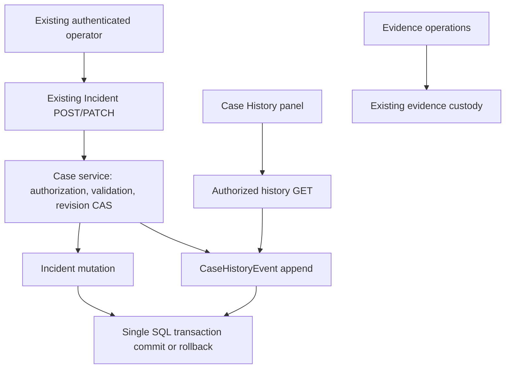

# Phase 5C — Case History & Audit architecture audit

Date: 2026-09-08. Design only. Database baseline: **0006**.

## 1. Findings

Incident is already the Case entity. Keep its UUID, table, owner attribution,
relationships, three-state lifecycle, revision and timestamps. The missing capability
is a durable account of accepted case-level changes; neither updated_at nor revision
records who changed a field or its prior value.

Reviewed [case service](../backend/app/services/incidents.py),
[case routes](../backend/app/api/routes/investigation_incidents.py),
[Incident model](../backend/app/models/incident.py),
[security](../backend/app/core/security.py),
[custody service](../backend/app/services/custody.py),
[custody model](../backend/app/models/custody.py), evidence metadata/timeline/retrieval
services, and frontend CaseWorkspace/CaseForm. The existing case route commits once
after the service completes; this is the appropriate atomic history boundary.

Current accepted transitions are open → investigating → closed and closed →
investigating; same-status edits are allowed. Every successful PATCH advances revision
and updated_at, including requests with unchanged field values. Preserve this behavior.
There is no assignment, archive, team or role workflow to audit in this slice.

Evidence notes, tags, annotations, timeline observations and retrieval preparation
already record evidence-level custody. Do not duplicate these into case history.
Forensic TimelineEvent occurrence time and case management recording time describe
different things. Case history is not a second forensic timeline or a custody chain.

Current authentication resolves one configured operator token to an active User.
Shared tokens do not distinguish humans. This design records the authenticated
principal actually available; it must not claim stronger attribution.

## 2. Recommended architecture

Add a small CaseHistoryEvent model/service and a read-only history route, retaining
Incident as source of truth. No general audit bus, middleware recorder, worker or
event-sourcing rewrite. Existing case service writes the event inside the same
transaction as creation/update. Route remains responsible for commit and rollback.

Minimal event vocabulary:

- `baseline_registered`: migration snapshot of an existing case at its existing
  revision; explicitly states that earlier history is unavailable.
- `case_created`: snapshot of initial title, description, status and severity for
  a new case, at revision 0.
- `case_updated`: one event per accepted PATCH containing the actual changed
  title/description/status/severity values. A combined status/severity edit produces
  one event, not redundant per-field and lifecycle events.

The UI derives “Status changed”, “Severity changed” and similar headings from the
changed fields. Reopening is status closed → investigating; no separate redundant
event is needed. Accepted same-value PATCH has an empty changes object and is labeled
“Case saved — no field changes”, with its revision/timestamp retained.

Do not accept client-authored audit events or require new reason/submission fields
on existing requests. No create idempotency expansion: an uncertain POST still
requires list review; the existing client must not auto-retry it.

## 3. Data model proposal

Proposed table: `case_history_events`; no new Case table or Incident columns.

- `id`: immutable server-generated UUID primary key.
- `incident_id`: required FK to incidents.id, ON DELETE RESTRICT; called Case ID
  in the UI. Retain one identity rather than storing a second case_id mapping.
- `revision`: required nonnegative Incident revision captured by the event.
- `event_type`: constrained baseline_registered / case_created / case_updated.
- `schema_version`: constrained integer 1 for typed payload evolution.
- `actor_type`: user or system.
- `actor_user_id`: FK to User with restricted deletion for user events, otherwise null.
- `actor_label`: bounded immutable display-name snapshot; never interpreted as a role.
- `system_actor`: fixed identifier for migration baseline events, otherwise null.
- `recorded_at`: required server UTC timestamp using existing UTCDateTime semantics.
- `changes`: bounded, schema-validated JSON keyed only by title, description, status,
  severity, each with before/after. Creation/baseline uses before null and an explicit
  snapshot meaning; baseline null does not claim those fields never existed.
- `source`: constrained api / trusted_cli / migration, supplied internally.

Constraints: exactly one actor identity; creation revision 0; update revision >=1;
baseline source/actor must be migration/system. Unique `(incident_id, revision)`
provides append ordering and duplicate defense, with an index supporting per-case
revision pagination. Validate payload field types/lengths using the existing case
limits; do not allow arbitrary JSON metadata, tokens, IP addresses or request bodies.
Legacy baseline snapshots preserve stored values even if older trusted creation
bypassed current API length rules; migration must preflight payload size and stop for
review rather than silently truncate or modify source data.

**Why no separate sequence/head:** Phase 5C records only creation and accepted
revision-changing case saves, plus one baseline at an existing revision. There are
no independent export/read/security events here. Revision therefore supplies a
unique order without modifying Incident. If future history includes non-mutating
actions, reconsider a separate sequence through a new design; do not force them
into this uniqueness contract. This is narrower than earlier broad audit proposals.

No cryptographic chain is proposed for this application history. Append-only guards
and access control prevent normal edits, but do not prove administrator-resistant
integrity. Existing evidence custody hashes remain independent and unchanged.

### Timestamps and concurrency

Capture one server time per accepted update and use it for Incident.updated_at and
the event recorded_at. Creation uses the initialized created_at. Migration baseline
uses actual migration recording time, not created_at or an inferred historical edit
time. Order by revision, not clock time; clocks can move backwards.

PATCH flow: authenticate; require owned Incident; read prior field values; check
expected_revision and transition; perform existing owner/revision conditional SQL
update; append case_updated for the resulting revision; flush; commit once in route.
The CAS winner's prior snapshot is valid for its expected revision; a loser never
persists a misleading before/after event. Retain source values for omitted optional
fields and exclude unchanged values from changes. Status and severity are validated
before any successful event can be committed.

Creation flow: create/flush Incident, append case_created with its revision and
actor snapshot, then commit both. Reuse this service for the trusted local incident
creation CLI while retaining its existing output and ownership checks. Source
trusted_cli records configured-principal attribution, not an invented browser login.
Do not automatically record arbitrary ORM writes via global hooks: those hooks lack
authenticated actor context. Trusted direct SQL/maintenance remains outside the
supported audit write path and must be documented as such.

### Failure and rollback behavior

- Stale revision or CAS rowcount 0: existing 409; no case or event change.
- Invalid lifecycle/input: existing 422; no event. Unauthorized: existing 401/404.
- History insert/constraint/serialization failure: roll back the entire case write;
  return sanitized write failure. Never commit a case and defer its history.
- Commit failure: rollback case, timestamp, revision and event together. No filesystem
  or evidence operation participates in this transaction.
- Response lost after commit: refresh case/history explicitly. Replaying PATCH with
  the old revision returns 409 and cannot add another event. It does not return an
  idempotent success receipt. Creation retries remain potentially duplicative and
  must remain manual after review.
- History read failure: show an explicit panel error and retry control; never display
  an empty history as if it proves no changes occurred. Reads never create a baseline.

## 4. Security, authorization and privacy model

Use existing Operator authentication and Incident ownership for history GET. Deny
device credentials, inactive users and foreign case IDs; return the same 404 as an
absent case. Authorize before querying history, counts or page positions. No new
roles, organization fields, membership permissions or owner transfers.

Actor ID/label/time/source are server controlled. Preserve historical labels when
user display names change. Shared-token and trusted-CLI attribution limitations
must be visible in documentation. No public history append/update/delete endpoint.
Return history only to the case owner; do not expose email, credentials or hidden
evidence metadata through actor or changes payloads.

Case descriptions can contain sensitive text. Retaining prior text is intentional
but increases retention exposure; bound API input, render it as escaped text, collapse
long values and avoid server logging of payloads. Do not embed acquisition paths,
raw bytes or full evidence/custody records in case history. Removing sensitive text
from the current description will not remove older versions. No automatic redaction
or deletion workflow is included; establish any legally required retention policy
separately before deployment. No compliance claim is made here.

Proposed append-only protection: no mutation API; ORM update/delete guards; SQLite
UPDATE/DELETE rejection triggers for the new table, tested against direct SQL.
These supplement restricted foreign keys and unique revision constraints. Privileged
administrators can drop triggers or replace databases; this is not external tamper
proofing. Do not alter existing custody triggers/guards or rewrite its records.
If another database is targeted later, review equivalent controls before claiming
the same guarantees. New history responses should explicitly use Cache-Control:
no-store without silently broadening this slice into global middleware changes.

## 5. Frontend presentation and read API

One additive proposed route:
`GET /api/v2/investigation/incidents/{id}/history`.
Use the existing shared in-memory InvestigationService and case access checks.
Existing list/detail/create/update response shapes remain unchanged.

Query: optional `after_revision` nonnegative integer (omit for first page), limit
1–100 default 50. Omission must include revision-0 creation/baseline; do not default
after_revision to 0 and accidentally skip it. Ascending revision order. Response:
`items`, `tracking_started`, `tracking_started_revision`, `next_revision` (last returned
revision only when more rows exist; otherwise null). Metadata is calculated after
authorization. Appends may appear on later pages; refresh starts again. No exact total
is necessary. When no rows exist, say tracking unavailable, not “no case activity”.

Add a Case History panel/tab within the current CaseWorkspace. Show actor label,
source, UTC recording time, case revision and grouped field diffs. Clearly label the
migration baseline and unavailable earlier history. Preserve Last updated and Created
labels; history is not the forensic Timeline or Evidence Custody screen.

Refresh history after confirmed case saves using the existing refresh lifecycle;
retain draft/conflict recovery behavior and never retry writes automatically.
Support loading, error/manual retry, empty/untracked state and load-more pagination.
Disconnect/401/navigation must abort reads and prevent stale responses. Keep keyboard
focus, mobile layout and escaped multiline text. No combined activity feed, evidence
preview, history editing, filtering engine or report export in this slice.

## 6. Migration requirements — design only

Persistence requires one future additive migration after **0006**. Do not allocate
or create it during this audit. Candidate contents: case_history_events, its unique
constraint/index/actor checks, append-only guards, and a baseline row for each
existing Incident at its current revision. No existing Incident field, ID, lifecycle,
timestamp, revision or relationship changes. No evidence/custody/timeline backfill.

Before any later migration: stop writers, verify configured database/revision, take
and validate a backup, inspect legacy payload sizes, then test a populated 0006 copy.
Use frozen migration-local table definitions and insert statements, not current
ORM creation hooks. Record system migration attribution honestly. Install mutation
guards after baseline population in the same transactional migration. Re-running
upgrade must not duplicate baselines.

Do not reconstruct earlier history from revision numbers or evidence custody.
An old case at revision 7 gets one baseline at 7; its first tracked update produces
revision 8. A new tracked case gets creation at 0 and updates at 1 onward. Migration
must preserve every old column/row and verify foreign keys/integrity. Rollback is a
reviewed backup restore/forward fix; destructive downgrade could erase history.
Old binaries can write cases without events, so do not run mixed writers after
activation. Include trusted CLI creation in deployment verification.

## 7. Testing strategy for a future approved implementation

- Populated 0006 upgrade: zero/new/high-revision incidents, null historical update
  times, linked evidence/timeline and nonempty custody chains. Compare every old
  column/record/hash, verify one honest baseline each and repeatable upgrade.
- API creation: exactly one event with actor/source/time and revision 0; trusted CLI
  creation records the same semantics without changing CLI output.
- PATCH: title/description/severity/status individually and together; omitted fields;
  same-value save; close/reopen; invalid transitions; expected-revision validation.
  Verify one event per accepted revision and accurate before/after values.
- Two competing updates: one CAS winner, one conflict, one event. Inject failures
  during event flush and commit to prove full rollback including updated_at.
- Authentication/owner matrix: absent/wrong/device/inactive credentials, foreign IDs,
  page requests and no metadata leakage. No event for failed/unauthorized writes.
- Read pagination: revision 0, nonzero baseline, page boundaries, new appends, empty
  tracking, bounds and no writes during GET. Timestamp clock reversal must not reorder.
- Immutability: ORM and SQL update/delete rejection; malicious actor/time input;
  constrained JSON and escaped script-like text. Verify guards' limits explicitly.
- Separation: case writes leave every evidence/custody/timeline row unchanged;
  evidence notes/tags/observations/retrieval do not produce duplicate case history.
- Frontend/service/browser: baseline disclosure, grouped diffs, no-field-change event,
  paging, refresh after save, failure/retry, 401 clearing, stale navigation, accessibility.
- Run full backend, frontend service, typecheck/build, browser and Windows collector/
  upload regressions after implementation. No tests are executed for this audit.

## 8. Exact Phase 5C implementation scope — pending approval

Backend: one CaseHistoryEvent model, one schema module, one history service, one
additive history GET, and transactional hooks in existing case create/edit service.
Wire trusted CLI case creation through the same supported service. Keep current API
request requirements, lifecycle, revision increments and updated_at semantics.

Expected candidate files (not created/modified now):

- `backend/app/models/case_history.py` and model registry.
- `backend/app/schemas/case_history.py`.
- `backend/app/services/case_history.py`.
- `backend/app/services/incidents.py` and case route module for actor/read integration.
- `backend/app/cli.py` for shared tracked creation.
- One approved migration under `backend/migrations/versions/`.
- `frontend/src/features/cases/CaseHistory.tsx`, case contracts and CaseWorkspace.
- Existing shared investigation service for one history read method.
- Focused backend history/migration tests and current incident, service and browser
  regression files; documentation/setup and a completion report.

No Incident history-head column or independent sequence is required under this narrow
event vocabulary. If implementation reveals a requirement for non-revision events,
stop and review the model rather than silently widening scope. Existing custody
services are reference patterns, not dependencies of case history appends.

## 9. Explicit out-of-scope items and audit verification

No separate Case table, teams/RBAC, ownership transfer, authentication/session system,
new lifecycle states, required closure reasons, case notes, AI, automatic decisions,
workers/automation, alerts, evidence analysis, report/export or cross-case access.
No duplicated custody, forensic timeline replacement, cryptographic case chain,
external audit service, global security-log redesign or historical reconstruction.

Only `docs/phase5c-case-history-audit.md` is created. Database checked read-only before
and after documentation remains **0006**, with unchanged file hash. Source,
configuration, dependency and existing documentation fingerprints remain unchanged.
No migration, source edit, package change, database write, test or build is performed.
Prior Phase 5B results remain recorded as 119 backend, 29 service and 34 browser tests
passing; this audit does not claim a new regression execution.

Stop after this audit. Await approval before any Phase 5C implementation.
