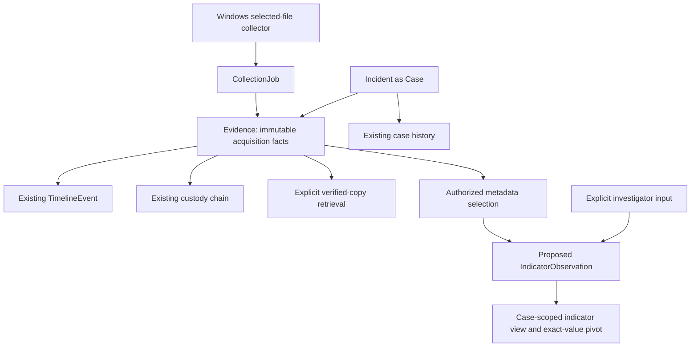

# Phase 6C — Threat Intelligence Foundation Audit

Date: 2026-09-12. Status: design only; implementation requires approval.

## Recommendation

Start with **case-scoped, evidence-linked indicator observations**, recorded explicitly by an investigator. Reuse Incident as Case, existing evidence authorization, and the shared investigation workspace. Distinguish an observable value or candidate IOC from a conclusion that compromise occurred. Do not label a file malicious because a hash exists or because two records share a value.

The smallest useful first delivery is a metadata-only SHA-256 pivot using existing evidence search, followed by a separately approved persistent observation feature. Neither requires opening original evidence. IP/domain observations can initially be manually entered with provenance; automated content extraction is a later design boundary, not a hidden prerequisite.

No implementation, migration, dependency installation, feed access, AI analysis or evidence retrieval was performed during this audit.

## Audit basis and existing capabilities

Reviewed these implementation sources and their current consumers:

- `backend/app/models/evidence.py`, `evidence_annotation.py`, `evidence_integrity.py`, `collection_job.py`, `timeline.py`, and `case_history.py`.
- `backend/app/services/evidence_query.py`, `case_intelligence.py`, `collection.py`, `evidence_retrieval.py`, and the existing authorization/query boundaries in `timeline.py` and `core/security.py`.
- Investigation evidence, incident and retrieval routes and investigation schemas.
- `agents/windows/collector.py` and its shared hashing/uploader imports.
- Frontend EvidenceSearch, EvidenceDetailsPage, CaseWorkspace, CaseIntelligencePanel and the shared investigation service.
- Phase 6A audit, Phase 6B implementation report and migration inventory through 0007.

This is a static architecture assessment plus read-only revision verification. Old private browser-test directories denied broad file enumeration; they are generated fixtures, were left untouched, and are not needed to assess application sources. No live evidence contents or credentials were inspected.

### Evidence and metadata

Evidence has a stable ID and incident relationship, filename, media type, byte size, SHA-256, private storage key, collector/user attribution, optional collection job/item IDs, source path, collection timestamp, verification timestamp and status. Display title, review state, metadata revision, tags and notes provide investigator context separately from acquisition facts.

SHA-256 is normalized and validated as 64 hexadecimal characters by the model. Evidence search supports exact SHA-256 filtering and bounded metadata filters. Its text search covers filename, display title and source path; it is not file-content, note-content or IOC search. Filename or path text containing an IP/domain is not proof of network communication.

Evidence records belong to one Incident. Their storage identity is an internal storage key, not a public URL or a source artifact locator for an indicator. Source paths are acquisition metadata and may contain sensitive user/device information; the existing authorized detail view exposes them, but a future indicator list should not copy them into broadly displayed summaries.

### Verification and collection artifacts

The Windows CLI collects explicitly approved regular files, rejects symlinks/reparse points, checks for source changes, stages bounded copies and calculates SHA-256. Collection jobs retain an approved selected-file manifest and requester/agent attribution. Upload verifies the submitted bytes and returns an idempotent evidence receipt. These are file-acquisition capabilities, not parsers for DNS logs, network traffic, browser artifacts or malware.

The collected_at value is an acquisition timestamp; it is not the first time an indicator was observed on a host. Initial verification proves a successful ingest comparison, not that the content is benign. Legacy records remain distinguishable from verified collection records.

EvidenceIntegrityCheck is a persisted structure; this audit found no reason to treat it as an implemented scanning or intelligence engine. Verified-copy retrieval checks a copy and records `evidence_retrieval_prepared`; it does not establish maliciousness, populate a threat verdict, or confirm delivery to the investigator.

### Cases, timelines and summaries

Incident remains the Case entity. Phase 6B's optional case-detail intelligence response calculates authorized evidence, timeline and history counts and the latest recording timestamp. It does not count threats, extract observables, correlate content or assign status automatically. Its existing metric meanings must remain unchanged.

TimelineEvent is the sole timeline model. It separates occurred_at from created_at and records investigator provenance, evidence linkage and idempotent submission identity. Legacy events can be unlinked; investigator observations are evidence-linked and append-only. An indicator's registration timestamp is not a forensic event time. Do not create timeline entries automatically from indicator registration.

CaseHistoryEvent records case creation/updates and revision history. Custody tracks evidence operations through its separate chain. Neither is a general-purpose indicator table; do not hide typed indicators in tags, custody JSON, or case-history changes.

### Current API and frontend reuse

- `GET /api/v2/investigation/evidence` already provides authorized exact-hash and metadata search with pagination.
- Evidence detail, notes, annotation and custody operations already provide source context and review workflows.
- Case detail's `include_intelligence=true` option supplies Phase 6B aggregates; case-history pages retain their revision cursor.
- Existing timeline list/detail/create operations provide attributed human observations. Existing download POST remains explicit and custody-recorded.
- Evidence details display/copy SHA-256 and collection references; evidence search accepts SHA-256 and incident filters. CaseWorkspace already hosts evidence, timeline and history, plus Phase 6B's independent summary panel.
- The shared frontend service owns an in-memory operator token and aborts requests on disconnect/authorization expiry. Reuse it; no new identity or session mechanism is needed.

No typed indicator entity, indicator API, dedicated indicator UI, extraction service, reputation verdict or external threat feed was found in application code.

## Missing workflow and indicator support

An investigator cannot currently save a typed candidate with normalized value, source field/locator, attribution and a reliable distinction between metadata-derived and manually reported information. Free-text notes can describe a finding but cannot safely substitute for typed equality, deduplication and provenance.

**Hash indicators:** SHA-256 has the strongest existing support. Offer a case-scoped exact-hash pivot immediately using current search. A later explicit “record hash observation” operation should take the hash from authorized Evidence on the server, not trust a submitted replacement hash. Preserve legacy/verified provenance. MD5/SHA-1 and recalculation of additional hashes are excluded from the first slice.

**IP indicators:** no structured IP field or extractor exists. Propose explicit single IPv4/IPv6 literal input, normalized by a deterministic local validator. Reject hostnames, ports, ranges, zone identifiers and ambiguous shorthand in v1. Preserve private/loopback addresses as observations without implying they are malicious. Perform no DNS lookup, connection, geolocation or reputation request.

**Domain indicators:** no domain normalization exists. Start with an explicit conservative ASCII domain-name policy: trim surrounding whitespace, lowercase, optionally remove one terminal dot, validate bounded labels, and reject URLs, paths, wildcards, userinfo and IP literals. Store the submitted form separately. Unicode/IDNA and defanged input need a separately specified policy; reject unsupported forms instead of silently guessing. Do not infer registrable-domain ownership or resolve names.

**File indicators:** use SHA-256 for exact file-content pivots and filename as a separately typed, low-specificity observation. File size and collection/source references remain on Evidence. Preserve filename spelling and do not apply Windows path normalization to values from unknown sources. Full paths, fuzzy hashes, MIME-derived verdicts and executable metadata extraction are deferred. Equal filenames are not equal contents or proof of a shared threat.

**IOC extraction:** distinguish copying a stored hash/filename from parsing bytes. The first is explicit metadata promotion with no storage access. Manual IP/domain entry is investigator assertion, not extraction. Do not regex-scan all filenames, notes, timeline prose or uploaded bytes and claim extracted facts. Later byte extraction would require a separately approved format allowlist, encodings, resource limits, parser isolation, deterministic versions, offsets, privacy policy and failure semantics. Original evidence must never be executed or changed.

## Proposed minimal data model — design only

Recommend one new append-only `IndicatorObservation` table when persistent registration is approved. Do not introduce a global Indicator catalog, Case table, many-to-many evidence ownership, graph store or threat-scoring model for v1. One row represents one attributed assertion about one evidence record. The same value can have multiple source observations without losing provenance.

Proposed fields:

- `id`: UUID primary key.
- `incident_id`: existing Incident foreign key; server-derived from the evidence.
- `evidence_id`: required Evidence foreign key. Composite evidence/incident foreign key prevents cross-case attachment; delete behavior RESTRICT.
- `kind`: bounded enum `sha256`, `ip`, `domain`, `filename`.
- `raw_value`, `normalized_value`: bounded text. SHA-256 is exactly 64 hex characters; IP/domain/filename have explicit per-kind limits. Preserve the received representation without storing unrelated pasted text.
- `source_kind`: `evidence_sha256`, `evidence_filename`, or `manual`. Enforce compatible kind/source combinations.
- `source_locator`: optional bounded investigator-supplied citation, displayed as text. It is not a trusted filesystem path or automatically verified byte offset. Metadata sources use a fixed field name supplied by the server.
- `created_by_id`, `actor_label`: authenticated operator ID and server-derived attribution snapshot.
- `created_at`: server-owned UTC registration timestamp.
- `schema_version`: initial value 1, including the documented normalization policy.
- `submission_id`, `request_sha256`: actor-scoped idempotency identity and canonical request fingerprint, following the existing timeline submission pattern. This request digest is not an evidence hash.
- `supersedes_id`: optional self-reference for an explicit correction; must refer to the same incident/evidence and be authorized. Old rows remain visible.

Use a unique actor/submission constraint for transport retries, and a unique supersedes target if v1 permits only one successor. A correction is a new observation; no edit/delete endpoint. A rejected or withdrawn assessment can remain a separate existing investigator note in the first slice rather than inventing a verdict-state workflow.

Index incident/created_at/id for stable pagination, evidence/created_at/id for source views, and incident/kind/normalized_value for exact matching. Bound individual requests and page sizes. Do not impose global value uniqueness: it would merge unrelated provenance and could leak other cases through conflicts. Distinct submissions may repeat a value; distinguish observation count from distinct-value count if these metrics are ever added.

No numeric confidence, malicious/benign score, threat actor, feed payload, raw file contents, new case revision or background-job state is needed. Optional observed-at timestamps should be deferred until there is a justified temporal workflow; use existing TimelineEvent for human-recorded occurrence claims.

## Relationships and data flow

Indicator observations inherit access from their evidence; the incident link alone is insufficient. Case A's matching value must not reveal Case B's records. Multiple evidence items produce separate observations, grouped only within an authorized result set. Case-only observations without evidence and cross-case matching are deferred. There is no new evidence ownership relationship.

Do not automatically append custody events for metadata reads or duplicate historical acquisition/retrieval events. The proposed observation is an attributed derived record, not a custody operation. Original custody hashes and sequence remain unchanged. Do not append a CaseHistoryEvent for registration: its current contract is case mutation per revision. Future requirements for auditing parser byte access need a dedicated design before byte extraction is approved.

Keep Phase 6B counts and latest_activity_at definitions intact. New indicator records would not silently become timeline/history activity. A future indicator count or indicator timestamp would need an explicit additive API/UI contract.

## Proposed API and frontend boundaries

For the first hash-pivot slice, reuse evidence search/detail only; no backend or database expansion is needed.

For later approved persistence, proposed minimal additive operations are:

- POST `/api/v2/investigation/evidence/{evidence_id}/indicators`: register one observation or correction with source kind, typed value when manual, and submission ID. The backend supplies evidence-derived values and all identity/timestamp fields.
- GET `/api/v2/investigation/incidents/{incident_id}/indicators`: bounded cursor list with optional evidence, kind and exact normalized-value filters. Validate the requested evidence against both the incident and current evidence authorization.

These routes are proposals, not available endpoints. A separate detail endpoint is unnecessary if list responses contain the bounded observation and provenance. No bulk upload, resolve-domain, scan-file, enrich, delete or report-export operation is proposed.

Reuse the Case workspace for a candidate-observations section. Show type/value, source evidence link, manual versus metadata origin, actor, registration time and correction relationships. Require explicit submission; render input and domain values as plain text, not clickable destinations. Explain that candidates do not establish compromise. Provide loading, empty, sanitized failure and retry states. Preserve case filters and pagination; discard responses after scope change/disconnect. Keep token handling in the shared service and do not persist indicator drafts in browser storage by default.

## Security and failure review

1. **Authorization:** enforce Operator and current `require_evidence` scope on every read, insert, retry and correction lookup. That includes Incident owner AND collection requester for collected evidence. Device credentials must not grant investigation writes. Return indistinguishable not-found responses for absent/unauthorized sources and related IDs.
2. **Provenance:** the server selects acquisition fields. Manual input stays explicitly unverified; a locator does not prove a parser saw a value. Do not accept actor, storage key, evidence hash replacement or incident ownership from the request.
3. **Privacy:** paths, filenames, network addresses and source citations may identify people or internal infrastructure. Minimize stored context; never include tokens, private storage paths or raw bodies in logs/errors. No feed submission, DNS request, URL fetch or credential-bearing URL.
4. **Untrusted input:** typed length/character limits, safe SQL parameters, cursor binding to actor/case/filters, text rendering and deterministic normalization. Do not open a domain/path on behalf of the investigator. Reject unsupported inputs with validation errors, not guessed conversions.
5. **Atomicity:** one transaction authorizes and inserts an observation/correction. Unique submission keys prevent double creation on retry; identical retries return the saved row, conflicting payloads return 409. An uncertain network outcome retains the same submission ID for explicit retry. Database failure rolls back and returns a sanitized service error.
6. **Concurrency:** no Incident revision bump is required because no case field changes. The successor uniqueness rule prevents competing corrections; a loser reloads rather than overwriting history. Revalidate authorization before returning a saved retry result.
7. **Integrity:** no UPDATE/DELETE routes; use model protection consistent with existing append-only records and restricted application access. ORM guards alone are not tamper-proof against a privileged direct database writer. Do not claim cryptographic audit guarantees or reuse custody hashes as signatures for derived observations.
8. **Scalability:** one-row submissions and bounded keyset pages avoid eager cross-case scans. High-volume extraction, retention, limits and indexing benchmarks are separate work. No automatic backfill or synchronous unbounded parsing.

## Minimal implementation roadmap and migration decision

**First approval slice — metadata hash pivot:** add a clear case-scoped “find matching SHA-256” action using existing search. Distinguish identical-hash matches from verdicts. No migration, new dependencies, storage reads or indicator persistence.

**Second approval slice — persistent evidence-linked observations:** finalize field limits/normalization and correction semantics, then add the one table and the two proposed operations. A migration is necessary only for that approved persistence feature. At implementation time confirm the then-current head, back up the database, and use the next revision after 0007 if the head has not advanced. Preserve all Incident IDs, Evidence, TimelineEvent, CaseHistoryEvent and custody rows. Start the table empty; do not manufacture observations for existing files. Verify upgrade preservation, foreign keys and rollback policy. A downgrade that drops recorded observations is destructive and must not be silently executed.

**Third approval slice — investigator review UI:** connect the proposed case/evidence views to the shared API client and show provenance/corrections. Initially support SHA-256 and filename metadata promotion; add explicitly validated manual IP/domain entry when its normalization tests are approved. Do not add threat totals to Phase 6B implicitly.

**Deferred extraction review:** separately assess bounded offline parsing only when an actual artifact format and investigator need are specified. This audit does not authorize parsing, preview, background work, external enrichment or AI.

## Testing strategy for future implementation

- Hash pivot: existing SHA-256 query, locked case scope, legacy/verified labels, true empty results, network/401 handling, no raw-byte/download call, and unchanged overview counts.
- Validation: mixed-case hashes, invalid lengths, equivalent IP forms, rejected ports/ranges/zone IDs, domain casing/trailing dots, unsupported Unicode/defanging, filename case preservation, size limits and hostile HTML/control characters.
- Authorization: absent/invalid/device token, foreign incident, same-case evidence with foreign collection requester, forged evidence/case pairing, unauthorized cursor/correction/submission replay, no cross-case existence leakage.
- Persistence: exact retry versus conflicting reuse, concurrent duplicate submissions and corrections, atomic rollback, server attribution/UTC time, append-only behavior and no changes to original evidence/custody/case revision.
- Migration: populated 0007 upgrade to the approved next head, all existing records and chain heads preserved, empty initial indicator table, foreign-key/integrity checks and documented destructive downgrade handling.
- Browser: registration/provenance, correction history, empty/loading/error states, pagination, scope changes, disconnect cancellation, keyboard/mobile layout and plain-text domain presentation.
- Run full backend, frontend service, browser, typecheck/build and Windows collector/upload regressions when code is implemented. No test suite run is required for this documentation-only audit.

## Audit completion and explicit exclusions

Database revision was verified read-only as **0007**. The existing migration inventory ends at 0007. Source/configuration/dependency and database file fingerprints were checked against the audit baseline; only this audit document was created. No tests were run; Phase 6B's 133 backend, 37 frontend and 47 browser passes are historical results, not new audit test results.

Excluded: code changes, migrations, dependency changes, external feeds, DNS/network enrichment, AI, malware execution or analysis, automatic decisions, workers, teams/RBAC, Linux collection, case/evidence architecture replacement, original-evidence mutation, content parsing, automatic timeline/custody records, global indicator sharing and report export.

Phase 6C audit complete. Awaiting approval before implementation.
