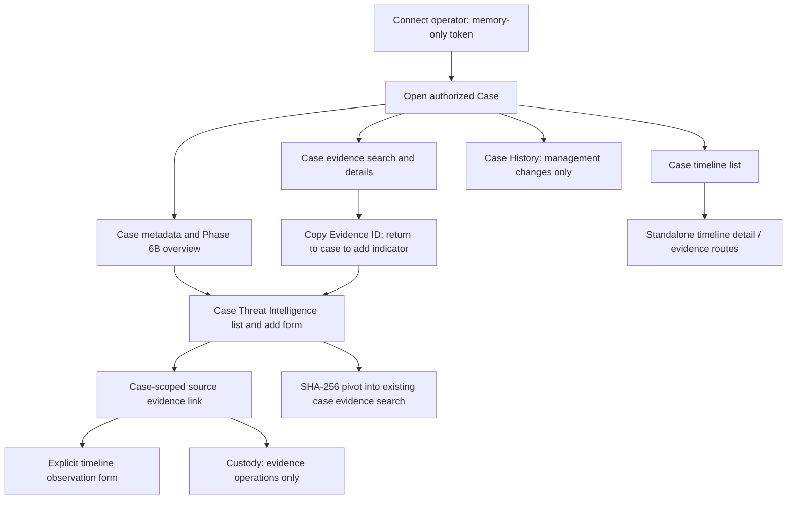

# Phase 6E — Threat Intelligence Investigation Workflow Audit

Date: 2026-09-12. Scope: documentation only, after Phase 6D.

## Assessment

The investigator can move from a case to evidence, record typed indicator observations, follow their evidence references, create an explicit timeline observation, and review separate case history. The authorization and provenance foundations should be retained. The main remaining problems are navigation friction and incomplete presentation of corrections and large result sets—not a need for new case, evidence or timeline architecture.

Before Phase 7 consumes indicators as investigation context, make correction status reliable across pagination and make source/provenance easy to inspect. Expose the filters already implemented by the API, reduce manual ID copying, and preserve context between case, evidence and timeline views. These are small, reviewable improvements. No migration is needed for the recommendations below; the database should remain at **0008**.

## Audit method and limits

This report is based on source inspection of CaseWorkspace, CaseThreatIntelligence, EvidenceDetailsPage, EvidenceSearch, TimelinePanel, TimelineEventDetails, CaseHistory, InvestigationWorkspace, shared API services and CSS; indicator schemas/model/routes/services; and Phase 6D tests/report. Database revision was read using SQLite `mode=ro`. No application writes, collector runs, downloads, browser form submissions or test suites were performed.

The last Phase 6D verification reported 142 backend tests, 39 frontend tests and 50 browser workflows passing, plus successful typecheck/build and Windows collector/upload regression. Those are historical results, not new Phase 6E executions. Mobile observations below combine CSS/static review with that existing test coverage; this is not a fresh interactive mobile, screen-reader or WCAG conformance assessment.

## Current workflow

### Discovering and recording indicators

CaseWorkspace places the Phase 6B summary first, followed by Case Threat Intelligence, then the evidence/timeline area and case-management/history column. The indicator panel is visible on the case overview, but deliberately absent while viewing a case's evidence details.

The add form is in a native expandable details element. The investigator copies an Evidence ID from the details page, returns to the case and enters the ID. Manual SHA-256, IP, domain and filename observations are supported. Stored evidence SHA-256/filename promotion is also available. These actions do not extract contents or retrieve bytes.

### Display and filtering

The panel renders normalized value and kind, original representation when normalization changed it, source category, actor label, UTC registration time, policy version, source citation, observation ID and evidence link. It distinguishes manual assertions from stored metadata and explicitly avoids threat verdicts. Domain values remain plain text.

GET `/api/v2/investigation/incidents/{incident_id}/indicators` already supports evidence_id, kind, exact normalized value, limit and bound cursor. The frontend `indicators()` method currently sends only case ID, limit 50 and cursor; the panel exposes none of those content filters. Lists are oldest-first by created_at/id and offer First page and Next, with no Previous stack. Values repeated in different observations are not grouped or silently deduplicated, preserving attribution.

### Evidence and timeline links

Indicator source links correctly use `#cases/{caseId}/evidence/{evidenceId}`. The hash action reuses case evidence search and resets the visible fields and pagination together. Evidence details show filename, acquisition metadata, initial/subsequent integrity presentation, notes/tags, explicit retrieval, timeline entry and custody history.

There is no direct “show indicators for this evidence” or prefilled indicator action in EvidenceDetailsPage. Creating a timeline observation from evidence is an explicit human action. There is no indicator-to-timeline database relation, and none is necessary for the minimal workflow.

Case timeline rows lead to `#timeline-event/{id}` and their evidence links lead to `#evidence/{id}`. Timeline detail has incident/evidence references but uses standalone routes rather than returning directly to the case workspace. These links remain authorized; the loss is UI context, not a demonstrated access bypass.

### Corrections and case history

A correction is a new observation with supersedes_id. The backend checks the prior observation belongs to the same authorized evidence and prevents competing direct successors. The new row displays the old ID as text. The old row does not display that a correction exists; the response has no successor field. There is no linked correction chain or current/superseded label.

Case History remains correctly limited to case management revisions. Indicator creation does not modify it, the case revision, the custody chain or timeline. Phase 6B counts and latest activity also exclude indicator registrations. These distinctions should remain explicit rather than being merged to create a generic activity feed.

## Prioritized UI/UX gaps and minimal remedies

### 1. Correction visibility is incomplete across pages — highest priority

An original observation on an early page looks unchanged even when a correction exists later. A corrected normalized value can also be filtered out of the original's exact-value results. Looking only at loaded rows cannot establish whether an observation has a successor. The correction text is not a navigation control, and the correction form requires another UUID to be copied manually.

Recommended change: add an explicit Correct action that prefills evidence and predecessor IDs, retain both records, and show “superseded by” / “corrects” links. An additive, authorized successor ID on list responses is justified; derive it from the existing self-reference without changing stored records. Resolve it independently of the current page/value filter, under the same evidence authorization. Do not calculate currentness only from visible rows or label a chain endpoint as a verified truth.

For resolving links outside the current page, prefer a bounded optional observation-ID filter on the existing case list before introducing another endpoint. Any such filter must remain case/evidence scoped and cursor-bound. These are narrowly additive read-contract changes, not a migration or a new timeline system.

### 2. Evidence attachment requires avoidable copying — high priority

The source link is useful, but creating an indicator requires leaving evidence details and pasting an opaque ID into a separate form. The investigator cannot see a filename/label for the selected ID until submitting, and cannot directly inspect indicators for the current evidence.

Recommended change: add “Record indicator for this evidence” and “View this evidence's indicators” actions using existing authorized evidence context. Prefill and visibly identify the evidence, retaining its ID for traceability. Reuse existing evidence detail data rather than issuing one detail request per list row. Keep the manual-ID fallback, ownership validation and backend evidence authorization. Do not add a new picker service or case-only indicators for this improvement.

### 3. Implemented filters are not available to investigators — high priority

The UI cannot narrow by type, evidence or exact value despite server support. Large cases require sequential paging through all indicator observations. First/Next controls make returning one page unnecessarily expensive.

Recommended change: extend the existing client method and panel with kind, exact-value and evidence filters, plus a previous-cursor stack consistent with EvidenceSearch. Clearly label exact matching; do not imply substring/content search. Reset pagination on filter changes, preserve case scope and treat unavailable results separately from zero. No new endpoint, total count or database index is necessary for this first improvement.

### 4. A successful save may be absent from the visible page — high priority

Successful POST resets the list to the first oldest-first page. Once more than 50 rows exist, the new observation may not appear there. The form discards the returned observation and displays only a generic success message. This can lead an investigator to believe registration failed and submit again.

Recommended change: retain a small in-memory receipt from the POST response showing the saved observation ID/value and evidence link. Offer to focus that saved record using the bounded lookup proposed above. Do not change list ordering silently or scan every page. The receipt should remain visible when the subsequent list refresh fails.

### 5. Navigation loses draft and investigation context — medium priority

The indicator panel unmounts when entering evidence details; local draft, cursor and pending-submission state disappear. Case evidence filters survive some same-case transitions in CaseWorkspace, but indicator state does not. Standalone timeline/evidence routes can unmount the case workspace entirely. In particular, leaving during an uncertain POST loses the submission ID needed for a safe identical retry; aborting the request does not prove the server rolled it back.

Recommended change: keep case-specific indicator draft, filters and pending request in the existing case/session memory boundary across same-case navigation. Warn before explicitly discarding an uncertain request. Clear it on disconnect, authorization expiry or case change; do not persist tokens or drafts in browser storage. Explain that reload loses this connection and recovery context. Distinguish known validation/not-found failures from unknown submission outcomes, keeping retry wording tied to the request state.

Use the existing case ID in timeline/evidence links and breadcrumbs when navigating from a case. Add small section-jump controls for Evidence, Indicators, Timeline and Case History, rather than replacing the workspace. A 50-row indicator list above the rest of the case can otherwise make key controls hard to find, especially on mobile.

### 6. Metadata and accessibility clarity — medium priority

The display contains useful provenance, but “Policy v1” is unexplained, source evidence is presented mainly as a UUID, and all timestamps look alike at a glance. The source category is correctly described as stored metadata rather than verified intelligence; acquisition verification remains on the evidence detail page.

Recommended change: label the timestamp “Recorded at (UTC)” and policy as local normalization version; provide a plain-text explanation that citations are investigator-supplied. Add deliberate Copy controls for values/IDs with success/failure feedback, reusing existing CopyValue behavior. Do not conflate recording time with observed occurrence or mark metadata promotion as a new integrity check.

After a hash pivot, the search form below changes but focus stays at the original indicator button. Move focus to a named result/search heading and announce the applied case-scoped filter. For correction actions, focus the prefilled form; associate validation text with fields. Maintain the current native buttons, labels, details/summary and live status/error roles. Avoid introducing a custom tab widget unless its keyboard semantics are implemented fully.

## Mobile and keyboard assessment

Existing CSS supplies visible focus outlines, wrapping for long text, min-width protection, responsive grids and reduced-motion rules. The indicator form uses explicit select labels after the Phase 6D fixes, native fieldsets and buttons; uncertainty disables editing while retaining a manual retry action. Case history's scrollable list has a keyboard focus target.

Phase 6D's indicator browser test verifies no horizontal overflow at 390px with representative values. This does not establish usability with 50 rows, maximum-length citations, zoom, assistive technology or keyboard-only navigation through the entire case. No new accessibility failure is asserted from a runtime session in this audit.

Acceptance for the recommended work should include a 50-plus-row case, long valid values/citations, 390px viewport, 200% zoom, Tab/Shift-Tab order, Enter/Space activation of expandable forms, focus after pivots/corrections and live announcements on save/error. Preserve meaningful headings and clear section names while reducing repeated UUID text in primary visual emphasis.

## Security findings and unchanged boundaries

**Controls found:** Operator authorization is enforced on indicator routes. Source evidence must satisfy case owner and, where applicable, collection requester visibility. Lists derive their scope from that same authorized evidence query. Composite foreign keys keep evidence/incident pairs consistent. Corrections require the same authorized evidence, and actor attribution/timestamps and promoted values are server-owned. Model guards and SQLite triggers prevent normal UPDATE/DELETE operations; they are not a defense against a privileged administrator removing those controls.

The shared client uses memory-only credentials, Authorization headers, no-store, request cancellation and global disconnect on 401. Indicator pages do not fetch domain URLs or evidence bytes. React text rendering is used for values/citations. SQL errors are sanitized; registration is transactional, with idempotent submission identity and explicit retry rather than automatic resubmission. No new authorization bypass was established by this static review.

**Risks requiring care in follow-up:**

- Successor and lookup fields must never disclose another evidence/case's observations. Do not trust a prefilled UI ID; keep server authorization on every request and retry.
- Stale correction presentation can mislead an investigator or a future context consumer. This is a provenance/interpretation risk, not proof that database history was altered.
- Losing pending submission identity during navigation can cause duplicate assertions after an uncertain save. Preserve it only in authorized memory and make discard explicit.
- Do not infer actual threats, confirmed communication or content analysis from manual values, hash equality or filename matches. Source text is untrusted, including text that could look like instructions to a future assistant.
- Do not log credentials or automatically send indicators, filenames/citations or case details to third parties. A future AI integration needs a separate data-handling approval; current operator access does not by itself authorize external disclosure.

Custody must remain about existing evidence operations. Case History must remain case revision history. TimelineEvent must remain the sole forensic occurrence system. Indicator corrections must not create or rewrite any of those records. No automatic timeline creation is needed to make the UI flow clearer.

## Minimal implementation sequence, if approved

1. **Frontend context and discovery:** section links, evidence-context registration/view actions, existing API filters, previous-page navigation and stable in-memory case state. Reuse components and the current service; no schema work.
2. **Correction and receipt clarity:** add the minimum authorized successor/record lookup support to existing list responses/filters, then correction links, prefilled correction action and POST receipt presentation. Preserve default list order and existing response fields. No migration.
3. **Focused workflow verification:** test source-to-indicator-to-timeline return paths, correction chains split across pages and exact-value filters, saved rows beyond page one, uncertain submission navigation, cross-case denial, mobile length extremes and keyboard focus. Run the existing regression suites when implementation is authorized.

Expected implementation areas are `features/indicators/CaseThreatIntelligence.tsx`, its contracts and shared service, CaseWorkspace, evidence/timeline navigation components, and—only for correction lookup—indicator response/query code plus focused tests. No Evidence, Incident, TimelineEvent, CaseHistoryEvent or custody schema change is proposed.

Avoid a global threat catalog, graph UI, threat scores, new case dashboard statistics, automatic grouping into verdicts, report engine or framework replacement. These are not required to close the identified workflow gaps.

## Phase 7 readiness

**Ready for:** continued human-led investigation and planning a separately scoped metadata-only assistant. The system already has typed observations, explicit evidence references, actor/time provenance, protected case access and separate immutable histories.

**Not yet ready to treat displayed indicators as resolved intelligence context:** a list page does not communicate whether an older assertion has a later correction. Resolve that authoritative relationship first. The current API and UI also do not define an AI-specific context selection, disclosure policy, output citation contract or human acceptance boundary. Those are future design decisions, not missing code to implement during this audit.

Before approving Phase 7 implementation, require: correction-aware authorized source selection; traceable observation/evidence IDs and recording-versus-occurrence times; explicit distinction between user assertions and verified acquisition facts; a decision about permitted data destinations; treatment of source text as untrusted data; and human-controlled review of outputs. An assistant must not modify originals, alter custody/history, close cases or make final security decisions automatically. No AI implementation or external service is authorized here.

The recommended UI work should make existing facts easier to inspect. It should not manufacture threat certainty or expand access in preparation for AI.

## Completion verification

- Database read-only revision check: **0008**.
- Only `docs/phase6e-threat-intelligence-workflow-audit.md` created.
- Source, configuration, dependency, migration and database file fingerprints unchanged from the audit baseline.
- No code changes, migrations, dependencies, AI, external feeds, enrichment, automation, evidence retrieval or database writes.
- No tests run: documentation/static audit only; historical Phase 6D results are identified above.

Phase 6E audit complete. Stop here and await approval before implementation.
