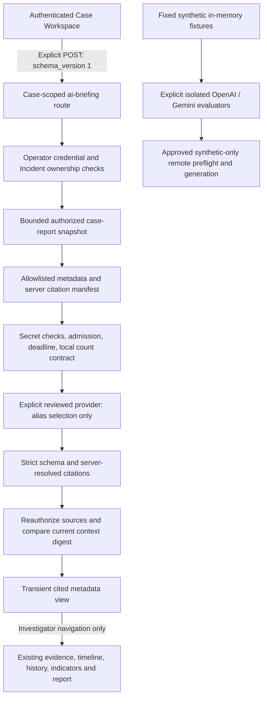

# Phase 7K — AI Investigation Assistant Architecture Audit

Date: 2026-09-15. **Documentation/design only. No implementation authorized by this document.**

## Recommendation

Implement a **Guided Cited Case Review** within the existing Case Workspace as the smallest next step. Reuse the existing AI-selected metadata briefing, deterministic case overview, report draft and authorized evidence/timeline/history/indicator views. Help investigators inspect the sources and distinguish observations from facts; do not introduce general chat, generated conclusions, new provider access or write actions.

Initial implementation can be frontend-only with existing APIs, transient state and no migration. Database revision remains **0008**. Do not enable the synthetic remote adapters for real investigations. Production provider approval and a compliant local counting implementation remain separate prerequisites, not implied by successful synthetic evaluation.

## Audit scope and evidence

Reviewed backend `ai_briefing`, `ai_context`, `ai_model`, `ai_adapter`, `ai_execution`, `ai_usage`, case-report and incident services; briefing/report schemas and investigation routes; operator authorization and provider initialization; frontend CaseWorkspace, CaseBriefing, briefing contracts, investigation service, report/timeline integration; relevant AI safety/briefing tests and Phase 7I/7J reports. No real evidence content or private credential values were read. No model evaluation or external provider request was made during this audit.

The user describes both provider evaluations as complete. Repository evidence differs: the OpenAI report still records two successful preflights but zero successful generations, with the diagnostic generation failing HTTP 429 and later scenarios unrun. Gemini's report records all four synthetic scenarios passing. Treat OpenAI implementation availability separately from live evaluation completion until its report is reconciled with further verified results. This audit does not overwrite that report or rerun evaluation.

Latest recorded regression baseline is **218 backend, 51 frontend service and 77 browser tests passing**, plus TypeScript/build and Windows collector regression. These are the prior verified results, not new test executions in this documentation-only audit.

## Current architecture

The generic application provider is explicitly injected or constructed from a reviewed configured script; no default remote provider is selected. The OpenAI and Gemini implementations live under `tests/` and independently reconstruct fixed fixtures. They are evaluation adapters, not interchangeable production integrations selected from the browser. The generic CommandProvider interface permits future providers without a registry/framework replacement.

## Current capability assessment

### AI briefing and citations

`POST /api/v2/investigation/incidents/{id}/ai-briefing` accepts only the versioned request. It does not accept arbitrary user prompts, model names, external URLs, raw context or another case's source list. The model returns only 1–20 distinct source aliases. The server resolves those aliases to stored fields and includes authorized indicator correction context, up to 40 displayed records. Unknown aliases, duplicate JSON keys, extra output fields and invalid correction relationships fail closed.

Output is `ai_selected_metadata`, with case identity/revision, snapshot time, context digest, prompt version, sources and limitations. This is **extractive source selection**, not a prose summary, explanation, reasoning transcript, truth assessment or threat verdict. Citation identity establishes provenance, not accuracy or completeness. The digest represents the metadata snapshot, not an evidence hash or custody-chain certificate.

### Existing input boundary

The server builds AI context from an authorized report, then narrows it further:

- Case: title, description, severity/status, revision and created/updated timestamps.
- Evidence metadata: filename/title, size/hash, acquisition/verification timestamps and status, review state, tags, metadata revision, custody sequence and recorded integrity result/time.
- Timeline: title/description, occurrence/reported/recording timestamps, origin, source and source locator.
- Indicators: kind, raw/normalized value, source information, recording time and correction links.
- Custody: sequence, event type, actor type and timestamp only.
- Case history: revision/event/time/source and supported before/after case fields.

Raw evidence bytes, evidence note bodies, actor identities, storage paths, custody detail payloads and arbitrary report sections are excluded. Provider inputs use aliases; evidence/correction links are represented by manifest aliases. Free-text values may still contain embedded identifiers, paths or secrets, despite structured-field exclusions. Existing exclusions must remain.

### Other investigation capabilities reused

Incident remains the owner-scoped Case entity with revision-safe updates and separate append-only case history. Evidence collection, immutable originals, verified-copy retrieval, custody, notes/tags, evidence-linked timeline observations, IOC observations/corrections and deterministic case summaries already exist. Report drafts compile recorded information with citations and remain transient; they are not AI-written reports.

AI generation and report viewing do not create custody or case-history events. Navigating to an evidence view is different from explicitly downloading it: authorized retrieval has its existing custody semantics and must never run automatically as an assistant side effect.

### Case Workspace and state

CaseWorkspace mounts CaseBriefing beside CaseReport, case intelligence and investigation panels. Briefing UI already supports explicit generation/cancel, loading, safe error messages, snapshot metadata, citations, source-evidence links, correction context, focus management and retention of a prior successful result after a failed replacement. Case/connection boundaries clear transient work; same-case refresh hides retained work while access is uncertain. Known authorization denial clears it. Reload and disconnect discard it.

The frontend service stores the bearer token in a closure, omits cookies, uses no-store requests, rejects redirects and aborts on disconnect. It checks returned case/version/kind and basic citation shape. These checks supplement, never replace, backend scope checks. No browser conversation/session persistence exists.

## Workflow opportunities and gaps

1. **Metadata summaries:** already partly supported by deterministic counts and selected recorded fields. Improve grouping, labels and disclosure of selection coverage. Never label the selected subset as the full evidence count. AI-written synthesis is absent and unnecessary initially.
2. **Timeline explanations:** the UI can present selected recorded observations chronologically and label occurrence versus recording time. This is a sourced chronological view, not a causal explanation. Free-form causal narratives require a future output/grounding design; timestamps must never be inferred.
3. **Evidence navigation:** highest immediate value. Existing evidence links work, but source types are otherwise mostly citation strings. Connect them to existing authorized views without model-authored URLs. Preserve current case context and make unsupported targets explicit.
4. **Investigation guidance:** provide fixed, non-executable review prompts such as reviewing source records and correction history. Label them as workflow guidance, not findings or claims that an action is necessary. Do not give the model command execution, a tool dispatcher, search across cases or mutation access.
5. **Report assistance:** reuse the existing report draft as the complete recorded-information reference, with briefing citations as a reading aid. Do not silently insert AI selections into reports or turn them into conclusions. Narrative AI drafting, exporting AI statements and report persistence are deferred.

Current gaps include no task-oriented presentation of a selected briefing, limited citation navigation beyond evidence, no explicit indication that a retained snapshot may have become old after generation, and no conversational question-answering or prose-level claim verification. The last two missing AI capabilities should not be filled by weakening the existing alias-only contract.

Navigation requires care: the current timeline has a global `#timeline-event/{id}` route and some source links use `#evidence/{id}`. Following those can leave the case workflow and clear transient case state. This is a UX continuity issue, not evidence that backend authorization is bypassed. The initial assistant should prefer existing case-local evidence navigation and in-case panel selection; do not promise a case-local timeline detail route that does not yet exist.

## Security analysis and boundaries

### Authorization and isolation

The server authenticates the configured operator token against its digest and an active User. Incident access is checked against `created_by_id`; unavailable/foreign incidents return 404. This is not teams/RBAC or a general multi-operator identity system. Agent credentials remain separate.

The briefing service rechecks operator identity, case ownership and source scope before dispatch and after computation. It rebuilds the current context and rejects digest changes with 409. Preserve these checks for every future computation; no cached prior authorization, cross-case context pooling, client-selected case scope or provider-generated identifiers. Server-generated source navigation must remain bound to the active case, and its target endpoint must authorize again.

There is no push revocation or continuous freshness guarantee for already rendered memory. A retained result describes its snapshot; its presence must not imply current case access or current facts. Refresh, denial, connection changes and case changes must maintain the existing hide/clear rules. Revocation cannot erase information already seen or disclosed externally.

### Prompt injection and output trust

Instructions explicitly declare metadata untrusted. The meaningful containment is structural: no model tools/actions/prose; strict aliases resolved by the server. Prompt instructions alone are not an injection defense. Hostile metadata can still bias source selection, omit important records or display as a quoted stored assertion. Render as plain text; never execute markup, commands, provider URLs or instructions embedded in source fields.

Do not turn the current citation mechanism into a claim that arbitrary AI prose is grounded. A valid citation can accompany an unsupported statement. New narrative outputs would need claim-level provenance and substantive entailment/contradiction evaluation, abstention rules and investigator review; those are outside the initial plan.

### Data exposure and provider privacy

Known operator/agent token patterns, current credential/digest and configured provider-key checks are useful but not complete secret/PII detection. Metadata alone can disclose sensitive filenames, personal information or operational details. Do not widen the allowlist or feed note bodies, reports wholesale, file content or arbitrary prompts into the model.

A Gemini synthetic pass does not authorize real-data disclosure or establish retention, training, residency, contractual or breach-response guarantees. OpenAI store=false is likewise not proof of zero retention. Before any production remote use, require separate deployment/privacy approval, validated model availability, reviewed transport, and **local-only counting with actual framing**. The synthetic remote-count exception cannot be reused for real cases. Do not point normal configuration at evaluation scripts.

Keys remain backend-only; no provider selector/key field in the browser, credential URLs, debug body logs, analytics payloads or persistent prompt/response traces. This audit makes no provider calls and does not inspect credential values.

### Resource and operational limits

Preserve 64-KiB context, 128 sources, 2,048-character fields, 8,000 input tokens, 1,024 output tokens, 32-KiB provider output, one active computation and a 30-second combined count/generation deadline. Preserve default 5-second cooldown, 6 attempts/minute and 96/process lifetime; failed attempts consume budget. No retries, queues, fallback or workers are implied.

Limits are process-local, not a global multi-worker cost ledger. Process restart resets them. Reviewed child processes are resource isolation, not a security sandbox for hostile administrator code; injected Python providers can be noncooperative, in which case capacity is quarantined. Cancelling locally cannot guarantee remote billing/computation stops.

Report construction precedes the smaller AI context limit and is itself bounded to 2,000 rows, 2 MiB and five seconds using reviewed SQLite snapshot behavior. A large case can reject rather than summarize partially. Initially retain explicit rejection and the ordinary investigation views; no silent truncation, multi-request chunking or raised limits.

### Evidence/custody semantics

Keep upload hash verification distinct from later integrity results. Displaying custody entries is not chain verification. Retrieval preparation is not confirmed delivery. AI source selection must not infer maliciousness from a hash or indicator, equate a recorded assertion with fact, reconstruct missing history, or alter any source record. Existing correction-chain context must not be hidden by presentation filters.

## Minimal Phase 7K implementation roadmap (proposal only)

### Step 1 — Guided source review in the existing panel

Retain CaseBriefing and its existing generation action/endpoint. Add clear source-category grouping and controls for viewing **already returned** metadata. No inference on mount, tab selection, filter changes, navigation or case refresh. Grouping does not change what was sent to the model and must not be presented as a pre-disclosure filter.

Show active case, snapshot/revision, selected-source count, non-exhaustiveness, correction-context inclusion and a link/action to the complete case report. Distinguish the previous successful snapshot from a pending or failed replacement. Use deterministic labels and existing timestamps; no confidence percentages or invented intelligence scores.

### Step 2 — Case-scoped source navigation

Build actions from validated server-returned citation types and IDs, never model text. Reuse existing case-evidence routes and panel selection. For timeline/history/indicator citations, initially bring the investigator to the matching case section with the citation visible; do not silently fetch another case or invent unsupported deep links. Correction partners remain visible even when a user narrows the displayed category.

Any added in-case navigation callback must preserve pending indicator input, report/briefing snapshots and the existing case/connection reset boundary. Do not auto-download evidence, create observations, copy records into mutation forms or execute provider suggestions.

### Step 3 — Accessible review guidance and verification

Offer a short fixed checklist: inspect original recorded fields, distinguish occurrence from recording time, inspect corrections, and compare with the full report. Keep it explicitly generic. Preserve keyboard focus after generation/cancel/navigation, headings, status/alert announcements, readable mobile layout and hidden/inert inaccessible retained content.

The feature must remain useful when no AI provider is configured: existing report, overview and source views continue to work. No production remote-provider enablement is part of this UI implementation.

### Later gates, not part of initial implementation

A narrative metadata summary, timeline explanation, free-text Q&A or report-writing assistant would require an explicit new/versioned output contract, separate evaluation and reviewed data disclosure. Do not reinterpret `select_sources` as a chat API or accept prose in `ModelSelection`. Persistent reports, AI memory, teams/RBAC, automation and raw evidence parsing are not justified merely by introducing this navigation aid.

## Impact and proposed files

Initial backend/API/provider impact: **none**. Reuse existing briefing POST, report-draft GET, case detail/intelligence/history and authorized evidence/timeline/indicator APIs. No new `/assistant` endpoint, provider protocol, system prompt, schema or tool execution layer is needed.

Expected frontend implementation files after approval:

- `frontend/src/features/cases/CaseBriefing.tsx`: grouped cited review, clearer snapshot states and source actions.
- `frontend/src/features/cases/CaseWorkspace.tsx`: minimal in-case navigation callbacks and unchanged transient-state boundary.
- `frontend/src/features/cases/briefing.ts`: pure presentation helpers only if needed; preserve wire contract.
- Existing browser AI-briefing/case-continuity tests: category/navigation/accessibility/isolation regressions. Add focused helper/service tests in the existing harness if behavior is added there.

No evidence/timeline/history/indicator mutation service changes are proposed. Exact style/test paths should be finalized against the approved UI changes; do not add a new framework or dependency for grouping and navigation.

Database impact: **none initially**. Incident stays the Case entity; existing source IDs and relationships remain authoritative. No AI table, conversation log, vector index, embeddings, report storage, audit-event duplication or migration is needed. Outputs stay transient in the same authorized case workspace. Configuration and dependency impact: **none**.

## Required testing before implementation completion

- Backend regression suite remains passing: operator rejection, cross-case/source denial, revocation during generation, stale digest, malformed/unresolved/duplicate citations, correction context, size/time/usage boundaries and record preservation.
- Frontend/helper tests: grouped selection counts versus total case counts, deterministic labels, valid source-type mapping, unsupported/malformed targets, no provider-generated URLs, no automatic inference or writes.
- Browser: explicit generate/cancel; previous result retained on failed replacement; same-case navigation continuity; Case A data absent in B; disconnect/reload clearing; access-denial clearing; hidden content inaccessible while rechecking access; category filters cannot conceal required correction context; source actions stay case-scoped; keyboard/mobile behavior.
- Preserve full report, indicator retry receipts, evidence retrieval/custody, timeline and case-history workflows. Run full backend, frontend, browser, TypeScript/build and Windows collector regression at implementation closure.
- Use deterministic providers in automated workflows. Any further live evaluation remains explicit, bounded and synthetic-only; never use private cases as test fixtures. Add synthetic omission/injection checks but do not claim finite tests prove universal safety.
- Acceptance requires unchanged API/schema/configuration, no database writes attributable to the assistant, no automatic provider calls, no AI actions, and explicit source/snapshot limitations in the UI.

## Risks, rollback and limitations

Highest risk is accidentally treating successful synthetic adapters as production-ready disclosure paths. Next are scope loss through global navigation, presenting an incomplete selection as a complete investigation, confusing citations with truth, and preserving stale data under a misleading current label. Mitigate through the existing authorization boundary, case-local UI state and honest labels, not a new architecture.

Rollback of the initial proposal is confined to presentation components and tests; no migration/data rollback is required. Existing CaseBriefing and investigation panels remain available. Never claim rollback can undo external disclosure or downloaded material. Defer any requirement that needs larger limits, a provider protocol change or persistent state for separate approval.

## Audit verification

Read-only SQLite checks returned **0008**, integrity **ok**, **0 FK violations**. Database SHA-256: `8f8e520eb9e23d2354652990d114fcb5895f7f1b5e293f0135299f279acde969`, unchanged from the earlier verified baseline.

Only this audit document was created. Backend/frontend/agent/test/configuration/dependency files were fingerprinted for unchanged-content verification. No tests were run because this is documentation only. No migration, dependency, configuration, authentication, custody or investigation behavior changed. No external AI call or implementation was performed.

**Phase 7K architecture audit complete — awaiting approval before implementation.**
