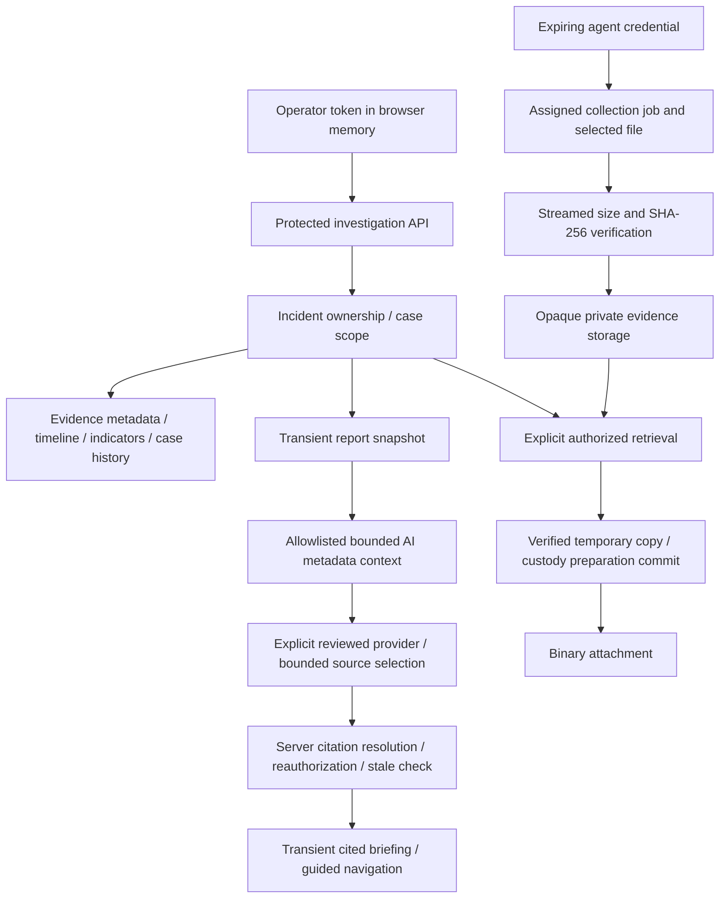

# Phase 8A — Final security and architecture audit

Date: 2026-09-15. Documentation-only review through Phase 7K.

## Release assessment

The current architecture supports a controlled local investigation pilot. It should not yet be represented as a hardened public or multi-user production service. The inspected access paths enforce operator/case ownership, and the AI workflow selects authorized metadata sources rather than generating executable instructions or verdicts. No confirmed cross-case authorization bypass was identified in this static review. This is not a penetration-test certification or proof that all vulnerabilities are absent.

The highest-priority release work is a documented, tested deployment boundary: TLS, private storage and backups, sensitive-response/log handling, resource limits and credential operations. A backend redesign, new authentication system, migration or expanded AI permission is not justified by this audit.

Remote-provider evaluation and permission to transmit real investigation metadata are separate gates. The inspected OpenAI report still records unsuccessful live generation; the Gemini report records four passing synthetic scenarios. Do not advertise both providers as production-validated.

## Scope and method

Reviewed route composition and operational settings; operator/device authentication; incident/evidence ownership queries; upload/storage/retrieval and custody services; history/indicator append-only protections; AI context, adapter and execution boundaries; frontend authentication, API client, case workspace and guided review; migration history; setup documentation and regression reports/tests. Source references below are repository-relative.

No application server, browser workflow, collector or model evaluation was invoked. No credential value or original evidence content was inspected. No provider was contacted. Configuration files were fingerprinted without exposing their content; the actual `.env` was not printed. This review does not verify deployed proxy headers, host ACLs, disk encryption, vendor retention agreements, dependency vulnerabilities or production load behavior.

## Current architecture and security boundaries

Incident remains the case entity. Evidence belongs to its incident; collection ownership adds another evidence authorization constraint. History records case mutations; custody records evidence operations. These are deliberately separate. Indicators are recorded observations with correction relationships, not threat verdicts. Reports and briefings are transient snapshots, not new authoritative case records.

### Authentication and authorization

- `backend/app/core/security.py`: a configured SHA-256 operator credential digest is compared with `hmac.compare_digest`; the configured user must exist and be active. Device credentials use separate hashed tokens, expiration and active-device/owner checks. Credentials are not interchangeable.
- `services/incidents.py` and `services/evidence_query.py`: owner-scoped database queries, including collection requester scope, return not-found for inaccessible records. UUID parsing or a frontend case route alone never grants access.
- Investigation, indicator, timeline, report and briefing routes require `Operator`; collection upload/manifest routes require `Device`. Registration, jobs and revocation require the operator. Indicator correction targets are checked in authorized evidence scope.
- `api/routes/auth.py` still contains the compatible email/password and session placeholders returning 501. They do not authenticate users or issue tokens. The frontend now explains the real bearer-token connection.
- There is no persistent browser session, token refresh, idle timeout or per-device operator revocation. Disconnect clears local state; it does not invalidate another client's bearer credential. Operator rotation is an administrator operation requiring consistent configuration rollout. Agent expiry is separately enforced.

### API exposure, validation and errors

`main.py` exposes liveness/readiness and development API documentation; production mode disables OpenAPI/docs. Readiness returns a minimal status and sanitizes database failure. Legacy v1 placeholders remain nonfunctional, not alternative unprotected evidence APIs.

Pydantic schemas, UUID types, bounded filters/pages, revisions, constrained indicator values and cursor bindings provide input validation. `core/limits.py` bounds collection/investigation JSON bodies at 128 KiB and upload bodies by policy. That middleware does not cover every legacy endpoint. No application-wide admission control for unauthenticated requests was identified.

Expected investigation/provider/storage failures use safe messages. Not all collection database commits have a route-level sanitized exception wrapper. Default validation errors and server exception logs therefore need a deployment privacy review, even though the investigation client does not render arbitrary backend error bodies.

CORS origins must be explicit HTTP(S) origins without credentials, paths or wildcards. Defaults are loopback development origins. CORS is not an authorization mechanism and does not block non-browser callers. Production mode alone does not enforce TLS, trusted host policy or security headers.

### Data protection and custody

Upload accepts only approved job items, verifies streamed size and SHA-256, rechecks device/job access after receipt, and uses an opaque generated storage key. Duplicate job/item submissions return the existing receipt when identical. Originals are not executed. Filesystem promotion and database commit cannot form one atomic transaction; the existing documented crash window can leave an orphaned object.

`services/evidence_reader.py` checks storage keys, directory/link/reparse properties and regular-file handles. Windows reads deny concurrent write/delete sharing and verify the handle location. Retrieval verifies the full copy before recording custody and serving bytes. It reauthorizes after preparation and checks identity again. `investigation_retrieval.py` releases capacity even if closing the prepared copy fails.

Custody appends use sequence/head optimistic checks in the caller's transaction and a hash chain. Baseline tracking can start at first annotation/retrieval; it is not a retroactive complete acquisition chain. A retrieval event means a verified copy was prepared, not proof of delivery or saving. Report/briefing generation does not append custody or run an integrity recheck.

Custody ORM update/delete guards are application protections, not a database-administrator tamper barrier. Case history and indicator migrations include SQLite append-only triggers, but administrators remain trusted there too. Chain verification compares against a head in the same database; there is no external trust anchor. Stored upload verification is historical, not continuous proof of current disk bytes.

### AI and provider boundaries

`ai_briefing.py`, `ai_context.py`, `ai_execution.py`, `ai_adapter.py` and `ai_usage.py` preserve authorization before/after selection, current-context digest checks, source/field/byte/token limits, timeout/cancellation handling and admission budgets. The context is a bounded projection of authorized report metadata. Raw files and note bodies are excluded. Known credential canaries are rejected before dispatch.

The provider selects aliases from a server-built manifest. Strict output validation rejects extra/invented/duplicate/unresolved references; server resolution supplies record fields and correction context. Model prose, URLs, actions and verdicts are not accepted as instructions. Valid citations establish provenance, not factual truth, relevance or exhaustive coverage.

The normal adapter is explicitly configured administrator-reviewed Python code. It uses no shell, a minimal child environment, bounded stdout and discarded stderr. This is resource isolation, not an OS sandbox: a malicious configured script could read accessible files or make network requests. Production local-only counting depends on the reviewed adapter contract; generic wiring does not independently prove local execution of a tokenizer.

OpenAI and Gemini code in `tests/*synthetic_adapter.py` is evaluation-only. Exact fixed fixtures, explicit opt-in, pinned destinations/models, bounded requests and strict response/citation checks confine the approved remote-count exception. Normal provider setup does not inherit the synthetic opt-in/key environment. These tools must not be deployed as general real-case adapters.

`docs/phase7j-openai-gpt5-6-terra-evaluation-report.md` records 2/2 preflights but 0/2 accepted generations, including HTTP 429. `docs/phase7j-gemini-evaluation-report.md` records 4/4 final synthetic preflights, generations and grounding checks. Those are prior documented results, not new calls made during this audit.

### Frontend

`LoginPage.tsx` masks input; `InvestigationWorkspace.tsx` clears the input on submission and reports fixed safe errors. `features/evidence/service.ts` retains the token in a closure, omits cookies, rejects redirects, uses no-store requests and aborts outstanding work on disconnect. Searches found no application use of localStorage/sessionStorage, `dangerouslySetInnerHTML`, or console credential logging in `frontend/src`.

Case-keyed workspace state prevents reuse under another case. Same-case snapshots/pending work survive intended navigation; access refresh hides retained content and definitive denial clears it. A downloaded file or already viewed snapshot cannot be remotely erased. Client-side disconnection and memory handling do not defend against a compromised browser, extension or injected same-origin script.

Guided review uses fixed category/destination mappings and validated case-local references. It does not invoke downloads, writes, model calls or report creation merely by navigating. Corrections remain visible. Existing responsive/keyboard workflows are documented as passing; this audit did not rerun visual/accessibility checks.

## Findings and recommended fixes

Severity describes impact under the stated deployment condition, not a claim of an exploited vulnerability. No critical vulnerability was demonstrated.

### F1 — High for network release: deployment security is not supplied by application mode

Evidence: `main.py`, `core/config.py`, `docs/setup.md`, `docs/architecture.md`. No in-app TLS enforcement, global security-header policy or deployment enforcement of private storage was found. Existing documentation calls this a local pilot. Without a reviewed deployment, bearer credentials and investigation data could be exposed by transport, host access or frontend injection.

Recommendation: before network release, specify HTTPS termination, exact origins, host restrictions, restrictive service identity/ACLs, disk encryption, CSP/frame/referrer/nosniff policies and secret provisioning. Test the actual served frontend and API. Keep loopback development exceptions explicit. No claim is made that the current local host has insecure ACLs; they were not inspected.

### F2 — Medium: sensitive cache/log coverage is inconsistent

Evidence: collection job/receipt reads, evidence/notes/custody reads, timeline reads and case list do not all explicitly set response `Cache-Control: no-store`; newer report/briefing/history/indicator routes do. The browser sends no-store, but other clients and deployment proxies need a consistent policy. Search values appear in API query strings, which common access-log configurations can record. Unexpected database exceptions can include operational detail in server logs; default validation errors may echo rejected input.

Recommendation: separately approve consistent private response/error cache headers and a logging policy that excludes credentials, bodies and sensitive query values. Test proxy behavior and secret canaries in validation/error/exception paths. This audit did not establish an actual leaked log or cache entry.

### F3 — Medium; high if shared as multi-user identity: static operator lifecycle

Evidence: `core/security.py`, `InvestigationWorkspace.tsx`. One configured operator credential has no expiry/idle lifecycle or individual session revocation. Sharing it attributes actions to one identity. Local disconnect is not revocation, and cached snapshots are not continuously reauthorized.

Recommendation: retain the approved single-operator scope; document rotation, restart/rollout, user deactivation and workstation locking. Prove old-token rejection and state clearing. Do not claim enterprise identity/accountability or silently add sessions/RBAC. A multi-user release requires separate authorization design approval.

### F4 — Medium: availability limits are process-local and incomplete

Evidence: `main.py`, `core/limits.py`, `ai_usage.py`. Upload/retrieval/AI limits are per process; AI counters reset on restart. There is no durable global quota or general authentication admission control. Collection body limits do not cover the legacy auth placeholder. Large datasets also face bounded report/AI failures and SQLite concurrency limits.

Recommendation: define a tested single-process pilot capacity, ingress limits/timeouts and disk-space monitoring. Exercise slow clients, repeated unauthorized requests, storage exhaustion and restart behavior. Do not treat per-process AI budgets as account billing controls or add workers to evade bounds.

### F5 — Medium: evidence durability and audit trust require operational controls

Evidence: `storage.py`, `custody.py`, `models/custody.py`, migration 0007/0008, architecture documentation. No external custody anchor, immutable backup system or atomic filesystem/database transaction exists. Privileged tampering and crash orphans are outside the application guarantee.

Recommendation: document consistent database-plus-evidence backup/restore, protected retention, integrity verification and conservative orphan review. Verify original bytes and chain after a restore. Never automatically delete apparent orphan evidence. External anchoring is a later requirement only if the threat model demands it.

### F6 — High if real metadata is remotely enabled without review: metadata is still sensitive

Evidence: AI allowlists and provider process boundary. Case descriptions, filenames and source locators can contain secrets, personal data or hostile instructions even without raw file access. Known-token matching is not comprehensive DLP. A valid source-selection response can still omit relevant records or favor injected text.

Recommendation: keep real-data remote use disabled pending a separate privacy/egress/adapter review, accurate local tokenizer, model evaluation and explicit disclosure authorization. Pin/review executable adapter artifacts and restrict OS privileges/network reach. Expand synthetic adversarial/relevance testing without changing context permissions. No raw evidence, model actions or threat verdicts are justified.

### F7 — Medium: release evidence/documentation needs consolidation

Evidence: OpenAI report remains incomplete; Gemini is synthetic-only. `backend/README.md` retains earlier model counts and primarily foundation-era guidance, with mixed Python guidance (general setup versus Windows storage 3.13+). Phase reports are detailed but are not a single deployment runbook.

Recommendation: publish one versioned release matrix identifying tested runtime, migration head, test results, provider evaluation status, supported deployment profile and known limitations. Preserve historical reports rather than rewriting failed evaluations as successes. Run dependency/security scans and restore drills before claiming release assurance; these were not performed here.

## Release checklist for a separately approved hardening phase

- [ ] Define local pilot versus network release and explicit supported operator/concurrency model.
- [ ] Verify TLS, exact CORS, proxy/host settings, security headers and production documentation exposure on the deployed artifact.
- [ ] Prove response caching and access/error logging do not retain credential or sensitive investigation input.
- [ ] Verify backend-only secrets, least-privilege storage/backup ACLs, encryption and rotation/deactivation procedures. `.gitignore` is not a secret vault or proof of historical repository cleanliness.
- [ ] Exercise unauthenticated/foreign-case requests for every protected route, including history, corrections, reports, briefing and binary retrieval.
- [ ] Run full regression suites on the release artifact and record versions/warnings; include Windows collector upload/repeat, custody transaction rollback and retrieval cleanup.
- [ ] Test storage-full, crash/restart, timeout/cancellation, database contention and bounded resource exhaustion.
- [ ] Restore a consistent database/evidence backup into an isolated environment; verify revision, FK integrity, evidence hashes and custody chains.
- [ ] Keep synthetic provider tools isolated. Document the unresolved OpenAI evaluation gate and separate any future real-data authorization.
- [ ] Verify browser disconnect/reload/cross-case clearing, stale snapshot labels, explicit retry, keyboard/mobile operation and safe local report handling.
- [ ] Review locked dependencies and release packaging for vulnerabilities, secrets, test fixtures and unintended database/evidence inclusion.

## Verification, database and unchanged files

Read-only SQLite checks on `backend/shadowvault.db`: revision **0008**, `PRAGMA integrity_check` **ok**, `PRAGMA foreign_key_check` **0 violations**. Database SHA-256: `8f8e520eb9e23d2354652990d114fcb5895f7f1b5e293f0135299f279acde969`, matching the prior Phase 7K report.

Existing Phase 7K verification records **218 backend**, **54 frontend service/helper**, **81 browser** tests passed; TypeScript/build and Windows collector upload/repeat passed. These are historical results reviewed here, not tests rerun during this documentation-only task. No new test, provider evaluation, dependency scan or penetration test was executed.

The sole intended new file is this audit. A 252-file fingerprint baseline covers existing application sources, migrations, frontend tests, backend tests/provider tooling, agents, documentation and top-level backend/frontend configuration/dependency/database files. No existing file in that inventory was changed. No migration, dependency, configuration, provider, frontend or backend change was made.

## Remaining limitations and next boundary

This audit cannot establish operational security without inspecting a concrete deployment. Existing automated tests provide regression evidence, not universal injection resistance, evidence authenticity, legal sufficiency, exhaustive AI selection, vendor privacy guarantees or production scalability.

Recommended next work is a narrowly approved release-hardening plan addressing F1/F2 and operational acceptance evidence, while preserving authentication, case scope, custody and local-only production token counting. No new AI capability, teams/RBAC, automation, background workers or database change is recommended as part of that first step.

Phase 8A audit complete. No implementation performed; awaiting approval before release work.
