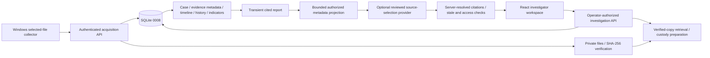

# Phase 8C — Demo and portfolio preparation audit

Date: 2026-09-15. Audit and preparation plan only. No demo records, screenshots, release package or deployment were created.

## Readiness assessment

The application has a demonstrable end-to-end investigation workflow. The strongest portfolio story is traceable, authorized investigation work: selected-file acquisition, verification, investigator observations and corrections, separate custody/history, and a cited report draft. It should be described as a controlled local DFIR pilot, not an autonomous detection product or a production-certified SOC platform.

The main preparation blocker is documentation drift. `README.md` still identifies Phase 3B and database 0004, calls case workflows placeholders and describes detection of suspicious activity. `docs/setup.md` still describes a sign-in form receiving 501 and points to older test counts. `docs/architecture.md` opens with reports/AI/case workflows unimplemented and diagrams only `/api/v1`. Those claims conflict with the current implementation and later phase reports. Correct them in a separately approved documentation phase before publishing.

AI needs an honest demonstration boundary. The current UI supports cited source selection and guided navigation, not open-ended chat, threat verdicts or narrative evidence analysis. The OpenAI report still records zero accepted live generations; Gemini's recorded success is limited to four fixed synthetic evaluation scenarios. Neither enables real-case provider use. No new provider call or configuration change is justified merely to populate a screenshot.

## Reviewed sources

Reviewed root README, setup/architecture documentation, Phase 8A/8B reports, security operations guide, Phase 2A collection guide, and current dashboard/case overview, Case Workspace, report, briefing and indicator components. Existing authentication, evidence, timeline, custody and provider boundaries are documented in the preceding security audits and regression reports. This review did not launch the application or inspect a live case, original evidence, secret values or browser session.

## Recommended demonstration: one clearly labeled synthetic case

Target a rehearsed 6–8 minute walkthrough; shorten it to a 60–90 second highlight video afterward. Keep one case title visible throughout so relationships are easy to follow.

1. **Connection, 30 seconds.** Show the empty masked operator-token page and explain that a provisioned bearer token grants access to owned cases. Pause recording to enter the dedicated demo credential. Resume after connection. Do not film provisioning output, paste operations, terminals, environment files or browser developer tools. Explain that disconnect/reload clears in-memory access; it is not a password login or universal revocation.
2. **Create/open case, 45 seconds.** Create `DEMO — Workstation log review` with a description declaring all records synthetic, and a manually chosen low/medium severity. Demonstrate the actual lifecycle `open → investigating → closed`, not the six-state proposal from older design documents. Change to investigating explicitly and show revision/last-updated information. Explain that counts represent recorded data, not threat counts.
3. **Collection and evidence, 90 seconds.** Pre-stage harmless text files in an isolated neutral demo directory. Use existing authenticated agent registration and collection-job APIs plus the Windows CLI; there is no claimed browser collection wizard or remote execution. Prefer preparing the evidence before recording and showing the resulting receipt/metadata without credentials or private source paths. Show filename, byte size, SHA-256, acquisition verification and evidence details. Add a note/tag through existing controls. Do not imply that upload verification is continuous integrity monitoring.
4. **Timeline and custody, 60 seconds.** Add a manually recorded observation from the evidence view with an explicit timezone-aware occurrence time. Open the case timeline, source evidence link and custody history. Distinguish occurrence time from recording time and custody from case history. If demonstrating retrieval, explicitly prepare/save a verified copy; explain the event means preparation, not confirmed delivery or local saving. Never execute downloaded evidence.
5. **Indicators, 60 seconds.** From evidence context, record a stored SHA-256/filename indicator and manual documentation-only IP/domain indicators. Show evidence-linked filtering, source metadata and correction visibility. Correct one intentionally labeled training transcription error without replacing the original. Describe these as investigator observations, never maliciousness determinations or external enrichment.
6. **Cited AI review, optional 45 seconds.** With no reviewed provider enabled, show the actual unconfigured state and explain the guided workflow. A separate existing deterministic test-fixture demonstration may show categories/citations/correction context, but must be visibly captioned “Synthetic test fixture — deterministic provider; not a live model result.” Do not present that output as Gemini/OpenAI generation. A live synthetic evaluation requires its existing exact fixtures and approval boundary; do not point the normal demo app at evaluation-only adapters or relax token counting. The demo can succeed without a live model call.
7. **Investigation report, 60 seconds.** Create the case-scoped report draft, expand evidence/timeline/indicator source citations and show scope/limitations. Explain that it organizes stored metadata, reads no raw files and adds no custody events. Optionally save the synthetic draft as text. It is transient in the workspace and is not a persisted, signed, PDF or AI-authored final report.
8. **Close, 30 seconds.** Show the explicit case status update and append-only case history, then disconnect. State the current limitations and separate local demonstration from deployment readiness. Do not leave disconnected/expired content visible in a recording by bypassing authorization.

Rehearse with prepared synthetic records so pagination, timestamps and correction links are known. Refresh counts manually after writes. Do not reload mid-demo expecting transient reports, briefing snapshots or pending submissions to survive. Do not change error/retry behavior for presentation. If an operation fails, show the truthful state and retry explicitly; use a separately labeled prior recording if needed, never fabricate success.

## Safe synthetic scenario design

Recommended primary scenario: **training workstation log review**, explicitly not a real compromise.

- Case title/description: prefix `DEMO` and explain that logs and observations are invented for testing.
- Files: small plain UTF-8 text such as `demo-workstation-log.txt` and `demo-operator-notes.txt`, containing fixed training events and no executable payloads, real usernames, organization names or credentials.
- Network strings: use a documentation address such as `192.0.2.10` and a reserved example domain such as `telemetry.example`. Do not resolve, connect to or enrich them. A string in a demo file is not proof of network activity.
- Hash: calculate from the actual harmless file and let the backend verify it; never invent a SHA-256 receipt or overwrite a verification status.
- Timeline: two or three fixed occurrence timestamps with UTC offsets, clearly declared fictional. Actual creation/recording timestamps remain server-generated; do not backdate database records.
- Notes/tags: `demo`, `synthetic`, and an explanation of what the investigator manually recorded.
- Correction: record a clearly labeled training typo, then append a correction to the same evidence. Retain both records and link them visibly.

Optional second scenario: `DEMO — Routine maintenance review`, with separate evidence and a different status, to demonstrate case filtering and absence of cross-case records. Avoid claims that all users are isolated based on switching between two cases owned by the same operator; use existing authorization tests as the evidence for foreign-owner denial.

Use a dedicated isolated demo database/storage root and fresh dedicated credentials in a later approved preparation step. Do not seed the current database, copy real records and “anonymize” them, or reuse real evidence as a template. Seed data must go through existing authorized workflows and retain real generated IDs/receipts; no manual SQL fabricated custody/history. Add no seeded accounts/tokens to production or published source. Keep any future fixture initializer explicit, opt-in and outside normal startup.

## Screenshot and recording strategy

Capture actual rendered UI with the above synthetic data only. No screenshot capture was performed in this phase; recommendations are based on current components and documented browser verification. Do not generate mock screenshots or edit statistics, status indicators, citations or error outcomes.

Recommended shots, in priority order:

1. **Case Workspace hero:** title, severity/status, revision/timestamps and investigation summary. Best main README image; communicates a real investigation workspace rather than a login screen.
2. **Evidence details:** synthetic filename, SHA-256, verification disclosure and custody section. Demonstrates traceability; keep original-verification versus current-integrity wording visible.
3. **Threat Intelligence panel:** evidence-linked observations, a correction and relevant filter. Caption “Recorded indicators and append-only correction context — no threat verdicts.”
4. **Timeline:** readable chronological observations with occurrence time/provenance and source links. Do not caption this automatic attack reconstruction.
5. **Report draft:** case identity, snapshot metadata and expanded citations. Caption “Transient metadata report with source references.”
6. **Guided review:** only if an honestly labeled fixture/approved synthetic result is available; retain advisory and snapshot text. Otherwise show unconfigured AI as a limitation, not a feature failure concealed by mock content.
7. **Operator connection / mobile view:** empty masked input or connected status plus a 390px workspace view. Useful supporting material, not the primary hero.

For GitHub, use one desktop hero plus three compact workflow images (evidence, indicators, report), descriptive alt text and a short demo-video link. For LinkedIn, use a 4–5 image sequence: case overview → verified evidence → corrections/timeline → report → boundaries/engineering results. For a presentation, use the architecture diagram, a stepwise case walkthrough, test evidence and a final limitations slide. These are editorial recommendations, not claims about platform upload specifications.

Prefer consistent desktop dimensions around 1440×900; crop to the relevant section without removing safety disclosures. Capture a separate mobile view rather than shrinking desktop text. Use legible browser zoom, consistent theme, captions, and a video transcript. Record in a clean dedicated browser profile with notifications disabled and unrelated tabs closed.

Pre-publication visual review must check every frame for tokens, clipboard popups, private filesystem paths, account identities, API keys, endpoint credentials, terminal output and downloaded report content. Prevent leakage at capture time; if an accidental credential appears, discard the artifact and rotate it rather than trusting blur alone. UUIDs/hashes may remain only when they belong to the isolated synthetic scenario.

## Documentation preparation plan

### README

Replace the outdated phase/status opening with the implemented feature set and DB0008. Remove unsupported “detect suspicious activity”/automatic reconstruction claims. Describe evidence-linked investigator timelines, indicators without verdicts, transient report drafts, metadata-only cited source selection and manual guided review. Explain operator tokens accurately, with no password-login implication.

Add a short synthetic-demo walkthrough, screenshots, installation prerequisites, current verification summary linked to Phase 8B, limitations, and a security-operations link. Refresh the directory overview for v2 APIs, custody/history/indicator models and AI safety services. Separate implemented capabilities from deferred ideas instead of listing both as planned modules.

### Architecture diagram

The main diagram should show both acquisition `/api/v1` and investigation `/api/v2/investigation`, Incident-as-Case, SQLite0008, private evidence storage, distinct custody/history, transient reports, and an optional reviewed metadata-only AI boundary. Reuse the existing architecture; do not imply raw evidence access by AI or active remote providers.

Proposed portfolio diagram:

This is a proposed presentation diagram inside the audit, not an architecture modification. Existing detailed security diagrams remain the source for trust-boundary explanations.

### Installation and usage

Consolidate current setup instructions instead of requiring readers to infer present behavior from historical phase notes. Retain locked Python installation, `npm ci`, Windows Python3.13+ storage requirements, Node22.18+ and installed Edge for browser tests. Explain both frontend API base URLs, exact CORS origins, working directory and first-time-only environment example copying. Never overwrite existing `.env`.

Document fresh database creation through existing migrations and require head0008; do not distribute the developer database or tell fresh users to adopt/stamp a legacy schema. Provision an isolated operator privately, then connect through the actual UI. Keep collection/API/CLI instructions separate from browser investigation instructions. Link the Phase 8B private logging command and distinguish local development from HTTPS deployment.

Create a concise current usage guide covering manual collection, notes/tags, timeline observations, corrections, report snapshots, disconnect, and explicit retries. Preserve historical phase reports; fix current entry-point documentation without rewriting past results.

No LICENSE file was found at the root. Decide licensing/redistribution intent before portfolio source publication; no license choice or file is made here. A local working directory without visible `.git` metadata cannot establish a clean repository history. Review the actual publication repository and package, not only this folder's ignore rules.

## Release preparation checklist

- [ ] Approved scope: portfolio/local demo, not public production service. No new AI/provider permission.
- [ ] Refresh misleading README/setup/architecture claims and link current limitations.
- [ ] Choose license/publication terms and review third-party notices.
- [ ] Inspect the exact publishable file set and repository history with a trusted local secret scan; never print discovered credentials into logs/chat. `.gitignore` alone is insufficient.
- [ ] Exclude `.env`, databases/WALs, backups, evidence roots, spool files, logs, reports, browser traces, dependency folders and personal test artifacts. Review root-level scratch files individually; do not publish a zipped working directory wholesale.
- [ ] Use only blank environment examples; all `VITE_*` values are public. Keep operator/provider keys out of screenshots and recordings.
- [ ] Rehearse installation in a separate clean directory/environment using existing locks and migrations. Verify DB0008/integrity/FK checks there; preserve the current database.
- [ ] Verify the documented operator connection and complete collection-to-report workflow with dedicated synthetic data.
- [ ] Run backend, frontend, TypeScript/build, browser and collector regression on the exact release candidate. Confirm browser teardown exit success, not merely individual passes.
- [ ] Confirm AI demonstration mode and label: unconfigured, deterministic synthetic test fixture, or separately approved fixed-fixture live evaluation. Never silently substitute one for another.
- [ ] Review every image/video/report for sensitive data and unsupported claims; retain uncertainty/citation/snapshot disclosures.
- [ ] Rehearse reset/disconnect and manual retry behavior. Do not alter application state preservation for filming convenience.
- [ ] For any hosted demo, separately complete Phase 8B deployment gates; publishing source/screenshots does not require exposing the backend publicly.

## Minimal next preparation scope, subject to approval

1. Update current README/setup/architecture and write one demo usage guide; retain historical reports.
2. Prepare isolated synthetic fixtures using existing authorized workflows, without touching the development database or normal startup.
3. Capture and privacy-review real screenshots/video; publish only approved artifacts.
4. Verify clean installation and release-candidate regressions, then inspect the exact publication package and licensing.

Likely future documentation/assets: `README.md`, `docs/setup.md`, `docs/architecture.md`, a new `docs/demo-guide.md`, and a dedicated screenshot directory such as `docs/images/demo/`. These are proposals only. Any fixture tooling or test changes need a concrete file plan after approval; none are created in Phase 8C. No core, authentication, provider, schema or security change is needed for this preparation.

## Verification and unchanged state

Read-only database verification: **0008**, integrity **ok**, **0 FK violations**. Database SHA-256 remains `8f8e520eb9e23d2354652990d114fcb5895f7f1b5e293f0135299f279acde969`.

Last recorded Phase 8B baseline: **224 backend**, **54 frontend**, **81 browser** tests passed; TypeScript/build and Windows collector regression passed. These results were reviewed, not rerun. No clean-install rehearsal, screenshot capture, secret scan, deployment or live-provider evaluation occurred in this documentation-only task.

A 258-file pre-audit fingerprint inventory covers existing sources, tests, providers, migrations, agents, documentation and root/backend/frontend files. The sole new file is `docs/phase8c-demo-preparation-audit.md`; existing files remain unchanged. No demo records, database writes, migration, dependency/configuration change or security/authentication/provider modification was made.

**Phase 8C audit and preparation plan complete. No implementation performed. Phase 8D not started.**
